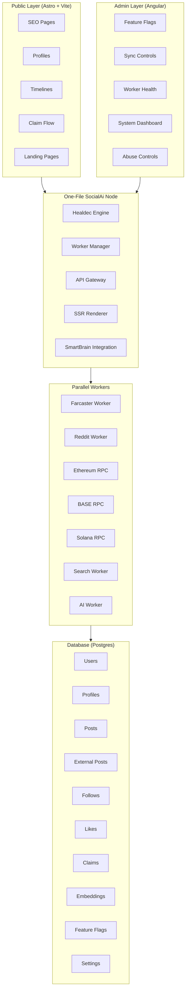
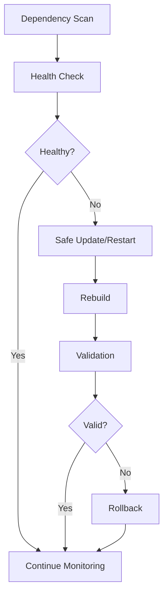
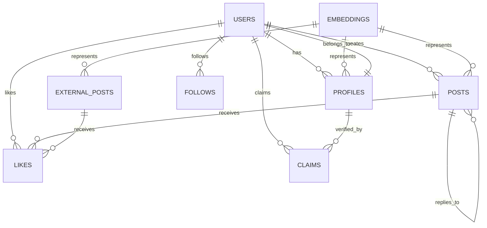
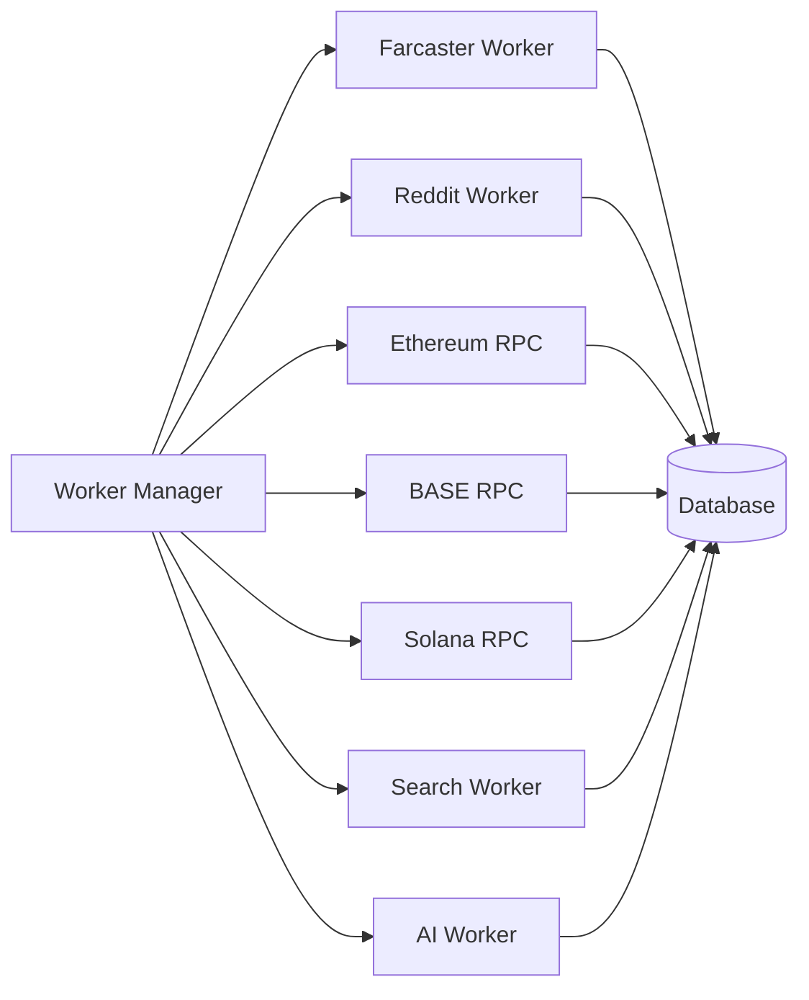
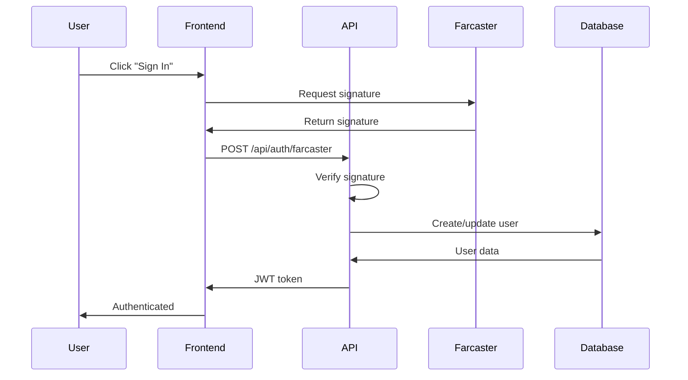

# SocialAi Architecture

**Version 1.0**

The SocialAi system is a lightweight, AI‑powered social discovery and identity claim network built on a **parallel, auto‑healing, one‑file node architecture** powered by Healdec and SmartBrain.

This document is the canonical architecture reference for the repository. It describes:

- High‑level system topology
- Core components and their responsibilities
- Data model and flows
- Worker orchestration
- Security and operational concerns
- Future extension plans

---

## Table of Contents

1. [High-Level System Overview](#1-high-level-system-overview)
2. [Backend Architecture](#2-backend-architecture)
3. [Frontend Architecture](#3-frontend-architecture)
4. [Data Model](#4-data-model)
5. [Worker Orchestration](#5-worker-orchestration)
6. [API Gateway](#6-api-gateway)
7. [Security Considerations](#7-security-considerations)
8. [Future Extensions](#8-future-extensions)

---

## 1. High-Level System Overview



### System Components

The SocialAi system consists of five major layers:

1. **Public Layer** - User-facing web application for social discovery
2. **Admin Layer** - Administrative console for system management
3. **Backend** - One-file node orchestrator managing all backend services
4. **Workers** - Parallel workers for data synchronization and processing
5. **Database** - PostgreSQL database with vector extensions for AI features

---

## 2. Backend Architecture

The backend is built as a **one-file orchestrator** (`socialai.node.js`) that manages all backend subsystems. This design simplifies deployment and maintenance while providing powerful orchestration capabilities.

### 2.1 Healdec Engine

The Healdec Engine provides auto-healing capabilities to ensure system reliability:



**Key Features:**
- **Dependency Scanning**: Continuously monitors worker health
- **Safe Updates**: Validates changes before applying them
- **Auto-Rebuild**: Rebuilds workers when needed
- **Validation**: Ensures changes don't break the system
- **Rollback**: Automatically reverts problematic changes
- **Health Checks**: Runs every 30 seconds
- **Max Restarts**: Limits restart attempts to 3 per worker

### 2.2 Worker Manager

The Worker Manager orchestrates parallel workers with automatic restart capabilities:

**Responsibilities:**
- Start and stop workers
- Monitor worker health
- Restart failed workers with exponential backoff
- Maintain worker state
- Log worker activity

**Configuration:**
```javascript
workers: {
  farcaster: { enabled: true, path: '../workers/farcaster.worker.js' },
  reddit: { enabled: false, path: '../workers/reddit.worker.js' },
  ethereum: { enabled: true, path: '../workers/ethereum.worker.js' },
  base: { enabled: true, path: '../workers/base.worker.js' },
  solana: { enabled: true, path: '../workers/solana.worker.js' },
  search: { enabled: true, path: '../workers/search.worker.js' },
  ai: { enabled: true, path: '../workers/ai.worker.js' }
}
```

### 2.3 API Gateway

The API Gateway provides RESTful endpoints with authentication and rate limiting:

**Features:**
- REST API endpoints for all operations
- Farcaster authentication (Sign-In with Farcaster)
- SIWE (Sign-In with Ethereum) support
- Rate limiting (100 requests/minute default)
- CORS configuration
- Helmet security headers
- Request logging

**Core Endpoints:**
- `/api/users` - User management
- `/api/profiles` - Profile operations
- `/api/posts` - Post CRUD operations
- `/api/timeline` - Timeline feeds
- `/api/search` - Search functionality
- `/api/claims` - Identity claims
- `/api/admin/*` - Admin operations

### 2.4 SSR Renderer

Server-Side Rendering integration with Astro for optimal SEO:

**Capabilities:**
- Pre-renders public pages
- Dynamic profile pages
- Timeline generation
- Claim flow pages
- SEO optimization
- Fast initial page load

### 2.5 SmartBrain Integration

AI-powered features using vector embeddings and LLM processing:

**Features:**
- Content summaries
- Personalized recommendations
- Topic clustering
- Profile optimization
- Semantic search
- Vector similarity matching

---

## 3. Frontend Architecture

### 3.1 Public Application (Astro + Vite)

**Technology Stack:**
- Astro for SSR and static generation
- Vite for fast development and building
- TypeScript for type safety
- Zero JavaScript by default (progressive enhancement)

**Key Pages:**
- `index.astro` - Landing page
- `profiles.astro` - Profile directory
- `profile/[username].astro` - Individual profile
- `timeline.astro` - Social timeline
- `claim.astro` - Identity claim flow

**Architecture Pattern:**
- Static Site Generation (SSG) for landing pages
- Server-Side Rendering (SSR) for dynamic content
- Minimal client-side JavaScript
- Progressive enhancement
- SEO-first approach

### 3.2 Admin Application (Angular)

**Technology Stack:**
- Angular 17+ for reactive UI
- TypeScript for type safety
- RxJS for reactive programming
- Angular Material for UI components

**Key Components:**
- **Dashboard Component**: System overview and metrics
- **Feature Flags Component**: Toggle system features
- **Sync Controls Component**: Manage data synchronization
- **Worker Health Component**: Monitor worker status
- **Abuse Controls Component**: Content moderation

**Services:**
- **API Service**: Backend communication
- **Auth Service**: Authentication management
- **State Service**: Application state management

**Architecture Pattern:**
- Component-based architecture
- Reactive data flow with RxJS
- Lazy loading for performance
- HTTP interceptors for auth
- Route guards for access control

---

## 4. Data Model

### 4.1 Core Entities



### 4.2 Database Tables

#### Users
Primary user accounts linked to blockchain identities.

```sql
CREATE TABLE users (
    id UUID PRIMARY KEY,
    farcaster_id BIGINT UNIQUE,
    ethereum_address VARCHAR(42) UNIQUE,
    ens_name VARCHAR(255),
    created_at TIMESTAMP,
    updated_at TIMESTAMP
);
```

#### Profiles
User profile information, claimable by identity verification.

```sql
CREATE TABLE profiles (
    id UUID PRIMARY KEY,
    user_id UUID REFERENCES users(id),
    username VARCHAR(255) UNIQUE NOT NULL,
    display_name VARCHAR(255),
    bio TEXT,
    avatar_url TEXT,
    banner_url TEXT,
    website_url TEXT,
    twitter_handle VARCHAR(255),
    claimed BOOLEAN DEFAULT FALSE,
    verified BOOLEAN DEFAULT FALSE,
    created_at TIMESTAMP,
    updated_at TIMESTAMP
);
```

#### Posts
Internal posts created by users.

```sql
CREATE TABLE posts (
    id UUID PRIMARY KEY,
    user_id UUID REFERENCES users(id),
    content TEXT NOT NULL,
    media_urls TEXT[],
    parent_id UUID REFERENCES posts(id),
    root_id UUID REFERENCES posts(id),
    reply_count INTEGER DEFAULT 0,
    recast_count INTEGER DEFAULT 0,
    like_count INTEGER DEFAULT 0,
    created_at TIMESTAMP,
    updated_at TIMESTAMP
);
```

#### External Posts
Posts synced from external sources (Farcaster, Reddit, etc.).

```sql
CREATE TABLE external_posts (
    id UUID PRIMARY KEY,
    external_id VARCHAR(255) UNIQUE NOT NULL,
    source VARCHAR(50) NOT NULL,
    author_id VARCHAR(255),
    author_name VARCHAR(255),
    content TEXT,
    media_urls TEXT[],
    url TEXT,
    parent_id VARCHAR(255),
    reply_count INTEGER DEFAULT 0,
    like_count INTEGER DEFAULT 0,
    metadata JSONB,
    created_at TIMESTAMP,
    synced_at TIMESTAMP
);
```

#### Follows
Social graph connections between users.

```sql
CREATE TABLE follows (
    id UUID PRIMARY KEY,
    follower_id UUID REFERENCES users(id),
    following_id UUID REFERENCES users(id),
    created_at TIMESTAMP,
    UNIQUE(follower_id, following_id)
);
```

#### Likes
User interactions with posts.

```sql
CREATE TABLE likes (
    id UUID PRIMARY KEY,
    user_id UUID REFERENCES users(id),
    post_id UUID REFERENCES posts(id),
    external_post_id UUID REFERENCES external_posts(id),
    created_at TIMESTAMP,
    CHECK (post_id IS NOT NULL OR external_post_id IS NOT NULL)
);
```

#### Claims
Identity verification records.

```sql
CREATE TABLE claims (
    id UUID PRIMARY KEY,
    user_id UUID REFERENCES users(id),
    profile_id UUID REFERENCES profiles(id),
    claim_type VARCHAR(50) NOT NULL,
    claim_value VARCHAR(255) NOT NULL,
    verified BOOLEAN DEFAULT FALSE,
    signature TEXT,
    created_at TIMESTAMP,
    verified_at TIMESTAMP
);
```

#### Embeddings
Vector embeddings for AI-powered features.

```sql
CREATE TABLE embeddings (
    id UUID PRIMARY KEY,
    content_id UUID NOT NULL,
    content_type VARCHAR(50) NOT NULL,
    embedding vector(1536),
    metadata JSONB,
    created_at TIMESTAMP
);
```

#### Feature Flags
System feature toggles.

```sql
CREATE TABLE feature_flags (
    id UUID PRIMARY KEY,
    flag_name VARCHAR(255) UNIQUE NOT NULL,
    enabled BOOLEAN DEFAULT FALSE,
    description TEXT,
    created_at TIMESTAMP,
    updated_at TIMESTAMP
);
```

#### Settings
System configuration.

```sql
CREATE TABLE settings (
    id UUID PRIMARY KEY,
    key VARCHAR(255) UNIQUE NOT NULL,
    value JSONB NOT NULL,
    description TEXT,
    created_at TIMESTAMP,
    updated_at TIMESTAMP
);
```

---

## 5. Worker Orchestration

### 5.1 Worker Architecture



### 5.2 Worker Descriptions

#### Farcaster Worker
Syncs data from Farcaster Hub:
- User profiles
- Casts (posts)
- Reactions
- Follows
- Syncs every 5 minutes (configurable)

#### Reddit Worker
Syncs data from Reddit API:
- Subreddit posts
- Comments
- User profiles
- Currently disabled by default

#### Ethereum RPC Worker
Monitors Ethereum blockchain:
- ENS lookups
- Wallet balances
- Transaction history
- Smart contract interactions

#### BASE RPC Worker
Monitors BASE blockchain:
- Wallet balances
- Transaction history
- BASE-specific features

#### Solana RPC Worker
Monitors Solana blockchain:
- Wallet balances
- Transaction history
- NFT metadata

#### Search Worker
Maintains search indexes:
- Full-text search
- Profile search
- Post search
- Tag search

#### AI Worker
Processes AI tasks:
- Generate embeddings
- Create summaries
- Provide recommendations
- Topic clustering
- Profile optimization

### 5.3 Worker Communication

Workers communicate with the database directly and do not communicate with each other. This design ensures:
- **Loose coupling**: Workers are independent
- **Fault isolation**: Worker failures don't cascade
- **Scalability**: Workers can scale independently
- **Simplicity**: No complex message passing

---

## 6. API Gateway

### 6.1 Authentication Flow



### 6.2 Rate Limiting

Default configuration:
- 100 requests per minute per IP
- Configurable via settings table
- 429 status code on limit exceeded
- Exponential backoff recommended

### 6.3 API Versioning

Current version: v1
Base path: `/api/v1/*`

Future versions will use separate paths to maintain backward compatibility.

---

## 7. Security Considerations

### 7.1 Authentication
- **Farcaster Sign-In**: Cryptographic signature verification
- **SIWE**: Ethereum wallet signature verification
- **JWT Tokens**: Stateless authentication
- **Token Expiration**: 24-hour default lifetime
- **Refresh Tokens**: Not yet implemented (future)

### 7.2 Authorization
- **Role-Based Access**: Admin vs. User roles
- **Profile Ownership**: Users can only edit claimed profiles
- **Feature Flags**: Admin-only access
- **Sync Controls**: Admin-only access

### 7.3 Data Protection
- **PostgreSQL Encryption**: Data at rest
- **HTTPS**: Data in transit (production)
- **Input Validation**: All API endpoints
- **SQL Injection Protection**: Parameterized queries
- **XSS Protection**: Content sanitization
- **CSRF Protection**: Token validation

### 7.4 Rate Limiting & DDoS Protection
- Request rate limiting
- IP-based throttling
- Exponential backoff
- Cloudflare integration (production)

### 7.5 Content Moderation
- Admin abuse controls
- Content flagging system
- User blocking
- Automated content filtering (future)

---

## 8. Future Extensions

### 8.1 Planned Network Integrations
- **Lens Protocol**: Social graph and content
- **Bluesky**: Decentralized social network
- **Zora**: NFT and creator content
- **Mastodon**: Federated social network

### 8.2 AI Enhancements
- Advanced recommendation algorithms
- Content quality scoring
- Spam detection
- Sentiment analysis
- Automated moderation

### 8.3 Scalability Improvements
- **Horizontal Scaling**: Multiple backend nodes
- **Worker Distribution**: Separate worker servers
- **Database Sharding**: Partition by user/region
- **CDN Integration**: Static asset delivery
- **Caching Layer**: Redis for hot data

### 8.4 Feature Roadmap
- **Real-time Updates**: WebSocket support
- **Push Notifications**: Mobile and web
- **Advanced Search**: Filters and facets
- **Analytics Dashboard**: User and system metrics
- **API Webhooks**: Event notifications
- **GraphQL API**: Alternative to REST
- **Mobile Apps**: Native iOS and Android

### 8.5 Developer Tools
- **API Documentation**: OpenAPI/Swagger
- **SDK Libraries**: JavaScript, Python, Go
- **Testing Framework**: Integration tests
- **Local Development**: Docker Compose setup
- **CI/CD Pipeline**: Automated deployment

---

## Conclusion

The SocialAi architecture is designed for simplicity, reliability, and extensibility. The one-file node orchestrator simplifies deployment while the parallel worker architecture enables scalability. The system is built with modern web technologies and follows best practices for security, performance, and maintainability.

For UI/UX specifications, see [UIUXSPECTS.md](UIUXSPECTS.md).  
For API documentation, see [API.md](API.md).  
For installation instructions, see [INSTALLATION.md](INSTALLATION.md)
