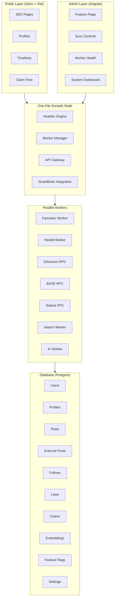
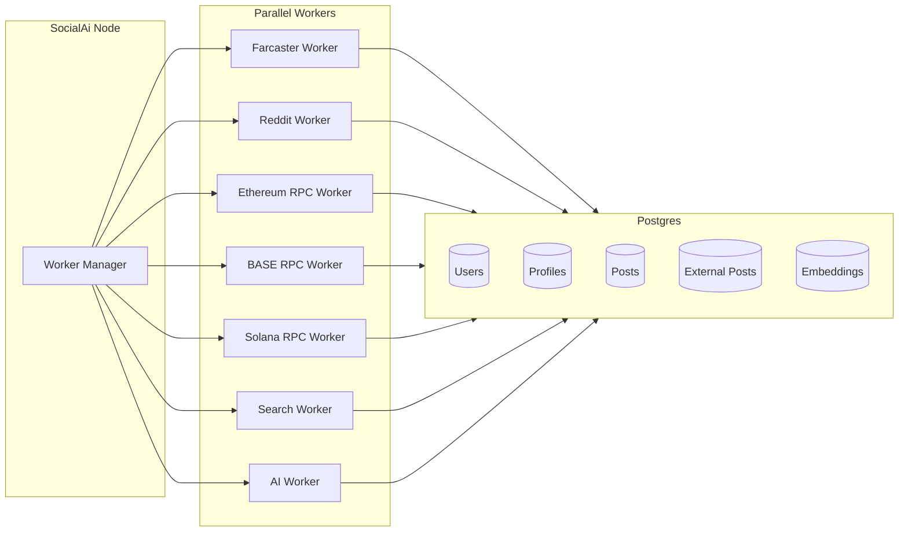

# SocialAi Architecture

This document provides a visual representation of the SocialAi application architecture, showing the key components and their relationships.

## System Architecture Flowchart



## Backend Architecture (Detailed)

The following diagram provides a detailed view of the One‑File SocialAi Node backend architecture:

```mermaid
flowchart TD

    Root["socialai.node.js (One‑File Orchestrator)"]

    subgraph Healdec["Healdec Engine"]
        H1[Dependency Scan]
        H2[Safe Update]
        H3[Rebuild]
        H4[Validation]
        H5[Rollback]
    end

    subgraph Orchestrator["Worker Manager"]
        O1[Start Workers]
        O2[Restart on Failure]
        O3[Parallel Execution]
        O4[Health Checks]
    end

    subgraph API["API Gateway"]
        A1[REST Endpoints]
        A2[Auth (Farcaster + SIWE)]
        A3[Rate Limiting]
    end

    subgraph SSR["SSR Renderer"]
        S1[Astro SSR]
        S2[Public Profiles]
        S3[Timelines]
        S4[Claim Pages]
    end

    subgraph SmartBrain["SmartBrain Integration"]
        SB1[Summaries]
        SB2[Recommendations]
        SB3[Topic Clustering]
        SB4[Profile Optimization]
    end

    Root --> Healdec
    Root --> Orchestrator
    Root --> API
    Root --> SSR
    Root --> SmartBrain
```

## Worker Orchestration Architecture

The following diagram shows how the Worker Manager orchestrates parallel workers and their interaction with the database:



## Component Descriptions

### Public Layer (Astro + Vite)
The public-facing layer of SocialAi, built with Astro and Vite for optimal performance and SEO:
- **SEO Pages**: Search engine optimized landing pages
- **Profiles**: User profile pages
- **Timelines**: Social activity feeds
- **Claim Flow**: Identity verification and claiming process

### Admin Layer (Angular)
Administrative interface for system management and monitoring:
- **Feature Flags**: Toggle features on/off
- **Sync Controls**: Manage data synchronization
- **Worker Health**: Monitor worker status
- **System Dashboard**: Overall system metrics

### Backend (One‑File SocialAi Node)
Core backend service powered by Healdec:
- **Healdec Engine**: Auto-healing orchestration engine
- **Worker Manager**: Manages parallel workers
- **API Gateway**: Request routing and handling
- **SmartBrain Integration**: AI-powered features integration

#### Detailed Backend Components

**socialai.node.js (One‑File Orchestrator)**
The central orchestrator that coordinates all backend subsystems in a single file.

**Healdec Engine**
Auto-healing system that maintains application health:
- **Dependency Scan**: Monitors and scans dependencies
- **Safe Update**: Safely updates dependencies with validation
- **Rebuild**: Rebuilds application when needed
- **Validation**: Validates changes before deployment
- **Rollback**: Automatically rolls back problematic changes

**Worker Manager**
Orchestrates parallel worker processes:
- **Start Workers**: Initializes worker processes
- **Restart on Failure**: Automatically restarts failed workers
- **Parallel Execution**: Manages concurrent worker operations
- **Health Checks**: Monitors worker health status

**API Gateway**
Handles all API requests and security:
- **REST Endpoints**: RESTful API endpoints
- **Auth (Farcaster + SIWE)**: Authentication via Farcaster and Sign-In with Ethereum
- **Rate Limiting**: Protects against abuse

**SSR Renderer**
Server-side rendering for public pages:
- **Astro SSR**: Astro-based server-side rendering
- **Public Profiles**: Renders user profile pages
- **Timelines**: Renders timeline views
- **Claim Pages**: Renders identity claim pages

**SmartBrain Integration**
AI-powered features and analysis:
- **Summaries**: Generates content summaries
- **Recommendations**: Provides personalized recommendations
- **Topic Clustering**: Groups content by topics
- **Profile Optimization**: Optimizes user profiles

### Parallel Workers
Independent worker processes for various data sources and operations:
- **Farcaster Worker**: Syncs Farcaster Hub data
- **Reddit Worker**: Syncs Reddit content
- **Ethereum RPC**: Ethereum blockchain interactions
- **BASE RPC**: BASE blockchain interactions
- **Solana RPC**: Solana blockchain interactions
- **Search Worker**: Search indexing and queries
- **AI Worker**: AI processing tasks

### Database (Postgres)
PostgreSQL database storing all application data:
- **Users**: User accounts
- **Profiles**: User profile information
- **Posts**: Internal posts
- **External Posts**: Posts from external sources
- **Follows**: Social graph connections
- **Likes**: User interactions
- **Claims**: Identity claims
- **Embeddings**: AI vector embeddings
- **Feature Flags**: Feature toggle states
- **Settings**: System configuration

## Data Flow

1. **Public requests** flow from the Public Layer to the Backend
2. **Admin requests** flow from the Admin Layer to the Backend
3. The **Backend** orchestrates Workers to perform operations
4. **Workers** interact with the Database for data persistence and retrieval
