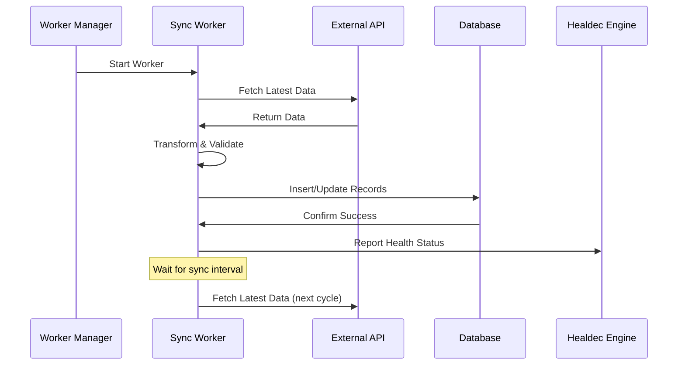
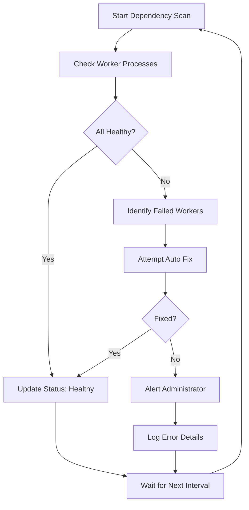
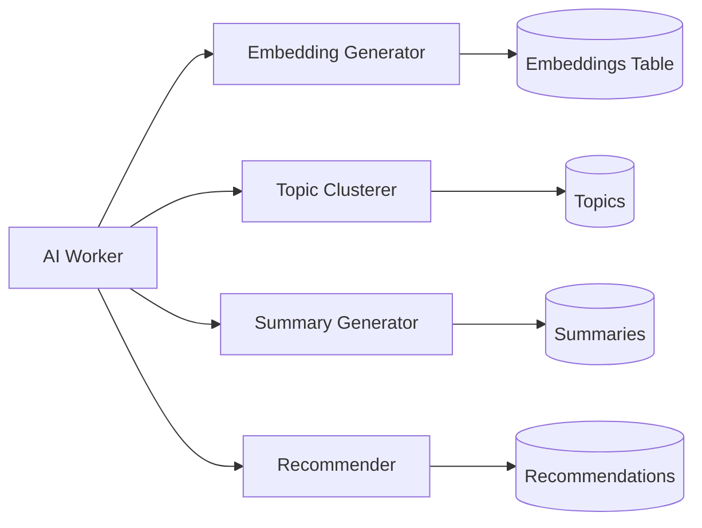
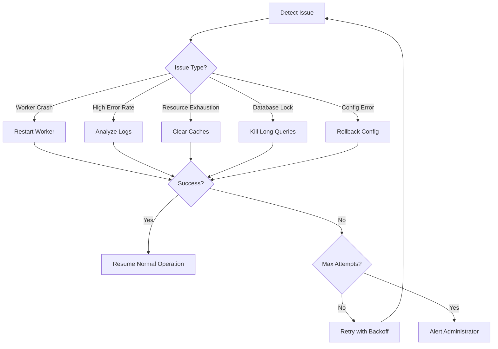

# SocialAi Features Documentation

This document provides comprehensive documentation for SocialAi's core features, with special focus on the automatic capabilities that make the system self-managing and intelligent.

---

## Table of Contents

1. [Auto Sync](#auto-sync)
2. [Auto Test](#auto-test)
3. [Auto Analysis](#auto-analysis)
4. [Auto Fix](#auto-fix)
5. [Identity Claim System](#identity-claim-system)
6. [Social Graph](#social-graph)
7. [Search & Discovery](#search--discovery)
8. [Admin Console](#admin-console)

---

## Auto Sync

**Auto Sync** is SocialAi's intelligent data synchronization system that automatically pulls and updates content from multiple external sources without manual intervention.

### Overview

The Auto Sync feature enables SocialAi to:
- Continuously mirror data from external social networks
- Keep user profiles and content up-to-date
- Scale synchronization based on activity levels
- Handle API rate limits gracefully
- Recover from network failures automatically

### Supported Sources

#### 1. Farcaster
- **What syncs**: Casts (posts), user profiles, reactions, follows
- **Sync interval**: Every 60 seconds (configurable)
- **API**: Farcaster Hub
- **Status**: Enabled by default

```javascript
// Configuration
workers: {
  farcaster: { 
    enabled: true, 
    path: '../workers/farcaster.worker.js' 
  }
}
```

#### 2. Reddit
- **What syncs**: Posts, comments, user profiles from specified subreddits
- **Sync interval**: Every 120 seconds (configurable)
- **API**: Reddit API
- **Status**: Disabled by default (configurable)

#### 3. Blockchain Data
- **Ethereum**: ENS names, wallet balances, transaction history
- **BASE**: Wallet balances, BASE-specific features
- **Solana**: Wallet balances, NFT metadata, transaction history
- **Sync interval**: Every 300 seconds (5 minutes)

### How Auto Sync Works



### Sync Worker Lifecycle

1. **Initialization**
   - Worker starts automatically on system boot
   - Connects to external API
   - Validates configuration
   - Reports ready status to Healdec

2. **Synchronization Cycle**
   - Fetch latest data from external source
   - Transform data to internal schema
   - Validate data integrity
   - Insert/update database records
   - Handle conflicts (use latest timestamp)
   - Update sync metadata

3. **Health Monitoring**
   - Report success/failure to Healdec
   - Track sync latency
   - Monitor API rate limits
   - Log errors for debugging

4. **Error Handling**
   - Retry failed requests (exponential backoff)
   - Skip corrupted data
   - Alert on persistent failures
   - Continue with partial results

### Configuration

#### Environment Variables

```bash
# Farcaster
FARCASTER_HUB_URL=https://hub.farcaster.xyz
FARCASTER_SYNC_INTERVAL=60000  # milliseconds

# Reddit
REDDIT_CLIENT_ID=your_client_id
REDDIT_CLIENT_SECRET=your_secret
REDDIT_SYNC_INTERVAL=120000

# Ethereum
ETHEREUM_RPC_URL=https://mainnet.infura.io/v3/YOUR_KEY
ETH_SYNC_INTERVAL=300000

# BASE
BASE_RPC_URL=https://mainnet.base.org
BASE_SYNC_INTERVAL=300000

# Solana
SOLANA_RPC_URL=https://api.mainnet-beta.solana.com
SOLANA_SYNC_INTERVAL=300000
```

#### Feature Flags

Control sync behavior via the Admin Console or API:

```json
{
  "farcaster_sync": true,
  "reddit_sync": false,
  "ethereum_sync": true,
  "base_sync": true,
  "solana_sync": true
}
```

### Admin Controls

The Admin Console provides real-time control over sync operations:

- **Enable/Disable** sync per source
- **Adjust sync intervals** dynamically
- **View sync status** and last sync time
- **Trigger manual sync** for immediate updates
- **Monitor sync health** and error rates
- **View sync history** and statistics

### Data Transformation

Each source has a dedicated transformation pipeline:

**Farcaster Cast → Internal Post**
```javascript
{
  external_id: "farcaster_123456",
  source: "farcaster",
  author_id: "1234",
  author_name: "alice",
  content: "Cast content...",
  metadata: {
    fid: 1234,
    hash: "0x...",
    mentions: [],
    embeds: []
  },
  created_at: "2024-01-01T00:00:00Z",
  synced_at: "2024-01-01T00:05:00Z"
}
```

### Performance Characteristics

- **Throughput**: 100-1000 records per sync cycle (varies by source)
- **Latency**: 1-5 minutes from source to database
- **Resource usage**: ~50MB RAM per worker
- **Network**: Minimal bandwidth (gzip compression)
- **Database**: Upsert operations with conflict resolution

### Monitoring & Metrics

Track sync performance in the Admin Console:

- **Sync success rate** (last 24 hours)
- **Average sync latency**
- **Records synced per hour**
- **API error rate**
- **Database write performance**

### Best Practices

1. **Start with essential sources** (enable Farcaster first)
2. **Adjust intervals based on traffic** (more active sources = shorter intervals)
3. **Monitor API rate limits** (avoid throttling)
4. **Enable feature flags gradually** (test one source at a time)
5. **Review sync logs regularly** (catch issues early)

---

## Auto Test

**Auto Test** is SocialAi's continuous validation and health checking system that ensures all components are functioning correctly.

### Overview

Auto Test provides:
- Automated health checks for all system components
- Dependency validation
- Configuration verification
- Performance monitoring
- Proactive alert generation

### Health Check System

#### Component Health Checks

The system monitors these critical components:

1. **Workers**
   - Process running (PID check)
   - Response to health ping
   - Last successful operation
   - Error rate tracking

2. **Database**
   - Connection status
   - Query performance
   - Connection pool health
   - Disk space

3. **API Gateway**
   - Response time
   - Error rate
   - Rate limiter status
   - Active connections

4. **External Services**
   - API availability
   - Response latency
   - Authentication status
   - Rate limit remaining

#### Health Check Frequency

```javascript
healdec: {
  healthCheckInterval: 30000,  // 30 seconds
  restartDelay: 5000,          // 5 seconds
  maxRestarts: 3               // Maximum restart attempts
}
```

### Dependency Scanning

The Healdec engine continuously scans dependencies:



### Validation Checks

#### Configuration Validation

Before applying any changes:

```javascript
async validate(target) {
  // 1. Check if target exists
  if (!CONFIG.workers[target]) {
    return false;
  }
  
  // 2. Validate file paths
  const workerPath = join(__dirname, CONFIG.workers[target].path);
  if (!fs.existsSync(workerPath)) {
    return false;
  }
  
  // 3. Check dependencies
  const dependencies = await checkDependencies(target);
  if (!dependencies.satisfied) {
    return false;
  }
  
  // 4. Verify database connection
  const dbHealthy = await checkDatabase();
  if (!dbHealthy) {
    return false;
  }
  
  return true;
}
```

#### Data Integrity Checks

- **Schema validation**: Ensure database schema matches expectations
- **Foreign key integrity**: Verify referential integrity
- **Data type validation**: Check data types match schema
- **Constraint validation**: Verify unique constraints and checks

### Performance Monitoring

Track key performance metrics:

- **Response time**: Average API response time
- **Throughput**: Requests per second
- **Error rate**: Percentage of failed requests
- **CPU usage**: Per worker and total
- **Memory usage**: Per worker and total
- **Database queries**: Query count and average duration
- **Worker latency**: Time to process tasks

### Alert System

Auto Test generates alerts for:

- **Worker failures** (immediate)
- **High error rates** (>5% errors)
- **Slow response times** (>500ms average)
- **Database issues** (connection failures)
- **Resource exhaustion** (>80% CPU or memory)
- **API failures** (external service down)

### Health Status API

Check system health programmatically:

```bash
# Overall system health (single endpoint)
GET /health
```

**Response Format:**
```json
{
  "status": "healthy",
  "timestamp": "2024-01-01T00:00:00Z",
  "components": {
    "database": { "healthy": true, "latency": 5 },
    "workers": {
      "farcaster": { "healthy": true, "lastCheck": "2024-01-01T00:00:00Z" },
      "ai": { "healthy": true, "lastCheck": "2024-01-01T00:00:00Z" }
    },
    "api": { "healthy": true, "responseTime": 150 }
  }
}
```

### Admin Console Integration

View test results in real-time:

- **Worker Health Dashboard**: Visual status indicators
- **Performance Graphs**: Response time, throughput, error rate
- **Alert History**: Recent alerts and resolutions
- **Health Timeline**: Historical health data

### Testing Modes

#### Production Mode (Default)
- Continuous health checks
- Automatic recovery attempts
- Alert generation
- Logging to database

#### Development Mode
- Verbose logging to console
- Reduced check frequency
- No automatic restarts
- Detailed error traces

#### Maintenance Mode
- Minimal health checks
- No automatic restarts
- Manual intervention required
- Extended timeouts

---

## Auto Analysis

**Auto Analysis** is SocialAi's AI-powered content processing system that automatically analyzes posts, profiles, and user behavior to generate insights and recommendations.

### Overview

Auto Analysis leverages machine learning to:
- Generate vector embeddings for semantic search
- Cluster content by topics
- Summarize long-form content
- Recommend relevant profiles
- Detect trends and patterns

### AI Worker Architecture

The AI Worker runs independently and processes tasks in batches:



### Vector Embeddings

#### What Are Embeddings?

Embeddings are high-dimensional vector representations of text that capture semantic meaning. Similar content has similar vectors.

- **Dimensions**: 1536 (OpenAI text-embedding-ada-002)
- **Storage**: PostgreSQL with pgvector extension
- **Use cases**: Semantic search, similarity matching, recommendations

#### Embedding Generation

The AI worker automatically generates embeddings for:

1. **Posts**: Content + metadata
2. **Profiles**: Username + bio + display name
3. **External Posts**: Synced content from other networks

**Processing Flow:**
```javascript
async processPostEmbeddings() {
  // 1. Find posts without embeddings
  const posts = await db.query(`
    SELECT p.id, p.content 
    FROM posts p
    LEFT JOIN embeddings e ON e.content_id = p.id
    WHERE e.id IS NULL
    LIMIT 10
  `);
  
  // 2. Generate embeddings
  for (const post of posts.rows) {
    const embedding = await generateEmbedding(post.content);
    
    // 3. Store in database
    await db.query(`
      INSERT INTO embeddings (content_id, content_type, embedding)
      VALUES ($1, $2, $3)
    `, [post.id, 'post', embedding]);
  }
}
```

#### Batch Processing

- **Batch size**: 10 items per cycle
- **Processing interval**: Every 2 minutes
- **Queue management**: Oldest items first (FIFO)
- **Error handling**: Skip failed items, continue with batch

### Topic Clustering

Auto Analysis groups similar content into topics:

#### How It Works

1. **Collect embeddings** for recent posts
2. **Apply clustering algorithm** (K-means or DBSCAN)
3. **Identify cluster centroids** (topic representations)
4. **Label topics** using representative content
5. **Update topic associations** in database

#### Use Cases

- **Trend detection**: Identify emerging topics
- **Content discovery**: Find related posts
- **Feed curation**: Group timeline by topics
- **Search refinement**: Topic-based filters

### Content Summaries

Automatically generate concise summaries for long content:

#### Summary Types

1. **Post summaries**: 1-2 sentences (50-100 chars)
2. **Thread summaries**: Key points from conversation
3. **Profile summaries**: User expertise and interests
4. **Timeline summaries**: Daily/weekly activity digest

#### Generation Process

```javascript
async generateSummary(postId) {
  // 1. Fetch post content
  const post = await getPost(postId);
  
  // 2. Call AI API (OpenAI GPT)
  const summary = await openai.chat.completions.create({
    model: "gpt-3.5-turbo",
    messages: [{
      role: "system",
      content: "Summarize this post in one sentence."
    }, {
      role: "user",
      content: post.content
    }]
  });
  
  // 3. Store summary
  await storeSummary(postId, summary.choices[0].message.content);
  
  return summary;
}
```

### User Recommendations

AI-powered profile and content recommendations:

#### Recommendation Types

1. **Profile recommendations**: "Users you might like"
   - Based on similar interests (profile embeddings)
   - Social graph overlap (mutual follows)
   - Content affinity (liked similar posts)

2. **Content recommendations**: "Posts you might enjoy"
   - Semantic similarity to liked posts
   - Topic alignment with user interests
   - Engagement patterns (time, frequency)

#### Algorithm

```javascript
async getRecommendations(userId) {
  // 1. Get user profile embedding
  const userEmbedding = await getUserEmbedding(userId);
  
  // 2. Find similar profiles using vector similarity
  const similar = await db.query(`
    SELECT profile_id, 
           1 - (embedding <=> $1) as similarity
    FROM embeddings
    WHERE content_type = 'profile'
      AND profile_id != $2
    ORDER BY embedding <=> $1
    LIMIT 10
  `, [userEmbedding, userId]);
  
  // 3. Rank by additional factors
  const ranked = await rankRecommendations(similar.rows, {
    mutualFollows: 0.3,
    contentSimilarity: 0.5,
    engagement: 0.2
  });
  
  return ranked;
}
```

### Sentiment Analysis

Detect sentiment in posts and comments:

- **Positive**: Upbeat, optimistic, enthusiastic
- **Neutral**: Factual, informational, balanced
- **Negative**: Critical, pessimistic, concerned

**Applications**:
- Content moderation (flag negative sentiment)
- Trend analysis (sentiment over time)
- User insights (typical user sentiment)

### Performance Optimization

#### Caching Strategy

- **Embeddings**: Cache in memory (LRU, 1000 items)
- **Summaries**: Cache for 24 hours
- **Recommendations**: Cache for 1 hour, refresh on user activity

#### Batch Processing

- Process multiple items in single API call (when supported)
- Use queue system for async processing
- Prioritize active users and popular content

#### Resource Management

- **Rate limiting**: Respect AI API limits
- **Cost control**: Monitor token usage
- **Fallback**: Use cached or approximate results when API unavailable

### Feature Flags

Control Auto Analysis features:

```json
{
  "ai_summaries": true,
  "ai_recommendations": true,
  "search_enabled": true
}
```

### Monitoring

Track AI performance:

- **Processing rate**: Items per minute
- **API latency**: Average response time
- **Error rate**: Failed requests
- **Cost tracking**: API token usage
- **Quality metrics**: User feedback on recommendations

---

## Auto Fix

**Auto Fix** is SocialAi's self-healing capability that automatically detects, diagnoses, and repairs system issues without manual intervention.

### Overview

Auto Fix enables the system to:
- Automatically restart failed workers
- Rollback problematic configuration changes
- Repair database inconsistencies
- Clear resource bottlenecks
- Recover from external service failures

### Healdec Engine

The Healdec Engine is the core of Auto Fix:

```javascript
class HealdecEngine {
  // Dependency scanning
  async scanDependencies() { }
  
  // Safe update with validation
  async safeUpdate(target, updateFn) { }
  
  // Rebuild/restart components
  async rebuild(target) { }
  
  // Validate changes
  async validate(target) { }
  
  // Rollback on failure
  async rollback(target) { }
}
```

### Auto Fix Workflow



### Automatic Worker Restart

When a worker crashes or becomes unresponsive:

1. **Detection**: Health check fails or process exits
2. **Analysis**: Check exit code and logs
3. **Decision**: Determine if restart is appropriate
4. **Restart**: Start new worker process
5. **Validation**: Verify worker is healthy
6. **Recovery**: Resume normal operations

**Restart Policy:**
```javascript
{
  maxRestarts: 3,           // Maximum restart attempts
  restartDelay: 5000,       // Delay between restarts (ms)
  backoffMultiplier: 2,     // Exponential backoff
  resetInterval: 3600000    // Reset restart count after 1 hour
}
```

**Example:**
```javascript
handleWorkerFailure(name, config) {
  const restartCount = this.restartCounts.get(name) || 0;
  
  if (restartCount >= CONFIG.healdec.maxRestarts) {
    console.error(`Max restarts reached for ${name}`);
    this.alertAdmin(name, 'Max restart limit reached');
    return;
  }
  
  const delay = CONFIG.healdec.restartDelay * 
                Math.pow(2, restartCount);
  
  setTimeout(() => {
    this.startWorker(name, config);
    this.restartCounts.set(name, restartCount + 1);
  }, delay);
}
```

### Safe Configuration Updates

Apply configuration changes with validation and rollback:

```javascript
async safeUpdate(target, updateFn) {
  // 1. Backup current configuration
  const backup = await this.backupConfig(target);
  
  // 2. Validate proposed changes
  const valid = await this.validate(target);
  if (!valid) {
    console.error('Validation failed');
    return false;
  }
  
  // 3. Apply changes
  try {
    await updateFn();
    
    // 4. Verify system still works
    const healthy = await this.healthCheck(target);
    if (!healthy) {
      throw new Error('Health check failed');
    }
    
    console.log('Update successful');
    return true;
  } catch (error) {
    // 5. Rollback on failure
    console.error('Update failed, rolling back');
    await this.rollback(target, backup);
    return false;
  }
}
```

### Database Repair

Automatically fix common database issues:

#### Connection Pool Exhaustion
```javascript
async fixConnectionPool() {
  // 1. Log current connections
  const connections = await db.query(`
    SELECT count(*) FROM pg_stat_activity
  `);
  
  // 2. Kill idle connections
  await db.query(`
    SELECT pg_terminate_backend(pid)
    FROM pg_stat_activity
    WHERE state = 'idle'
      AND state_change < NOW() - INTERVAL '5 minutes'
  `);
  
  // 3. Recreate pool
  await db.end();
  db = new Pool({ connectionString: CONFIG.dbUrl });
}
```

#### Long-Running Queries
```javascript
async killLongQueries() {
  await db.query(`
    SELECT pg_terminate_backend(pid)
    FROM pg_stat_activity
    WHERE state = 'active'
      AND query_start < NOW() - INTERVAL '5 minutes'
      AND query NOT LIKE '%pg_stat_activity%'
  `);
}
```

#### Deadlock Resolution
- Automatically retry deadlocked transactions
- Implement exponential backoff
- Log deadlock patterns for optimization

### Resource Management

Auto Fix monitors and manages system resources:

#### Memory Management
```javascript
async checkMemory() {
  const usage = process.memoryUsage();
  const heapUsedPercent = usage.heapUsed / usage.heapTotal;
  
  if (heapUsedPercent > 0.9) {
    console.warn('High memory usage, clearing caches');
    this.clearCaches();
    
    if (global.gc) {
      global.gc(); // Force garbage collection
    }
  }
}
```

#### Cache Clearing
- Clear expired entries
- Remove least recently used items
- Free memory for critical operations

#### Process Limits
- Monitor file descriptor usage
- Track database connection count
- Limit concurrent requests

### External Service Recovery

Handle failures in external services:

#### API Failure Handling
```javascript
async callExternalAPI(url, retries = 3) {
  for (let i = 0; i < retries; i++) {
    try {
      const response = await fetch(url);
      return response;
    } catch (error) {
      console.warn(`API call failed (attempt ${i + 1}/${retries})`);
      
      if (i < retries - 1) {
        // Exponential backoff
        await sleep(1000 * Math.pow(2, i));
      }
    }
  }
  
  throw new Error('API call failed after retries');
}
```

#### Fallback Strategies
- Use cached data when API unavailable
- Degrade gracefully (disable optional features)
- Queue requests for later processing
- Switch to backup endpoints

### Logging and Alerting

Track all Auto Fix actions:

#### Log Levels
- **INFO**: Successful fixes
- **WARN**: Issues detected, fix attempted
- **ERROR**: Fix failed, manual intervention needed
- **CRITICAL**: System stability at risk

#### Alert Channels
- Admin Console (real-time notifications)
- Email (for critical issues)
- Webhook (integrate with monitoring tools)
- Database (persistent log)

### Configuration

Enable/disable Auto Fix features:

```javascript
autoFix: {
  enabled: true,
  workerRestart: true,
  configRollback: true,
  databaseRepair: true,
  resourceManagement: true,
  externalServiceRetry: true
}
```

### Best Practices

1. **Monitor fix success rate** (should be >90%)
2. **Review failed fixes** (identify recurring issues)
3. **Tune restart limits** (balance availability vs. stability)
4. **Test rollback procedures** (ensure they work)
5. **Keep logs** (for post-mortem analysis)

### Limitations

Auto Fix cannot handle:
- Hardware failures (need physical intervention)
- Network infrastructure issues (ISP/datacenter problems)
- Security breaches (require manual investigation)
- Data corruption (may require restore from backup)
- Critical bugs (need code fixes)

For these issues, Auto Fix will:
- Alert administrators immediately
- Provide diagnostic information
- Attempt graceful degradation
- Preserve system state for analysis

---

## Identity Claim System

Coming soon...

## Social Graph

Coming soon...

## Search & Discovery

Coming soon...

## Admin Console

Coming soon...

---

**Document Version**: 1.0  
**Last Updated**: February 2026  
**Status**: Complete
