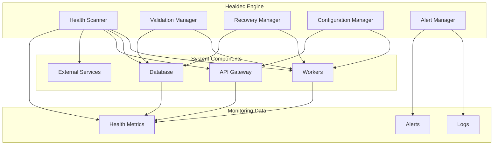
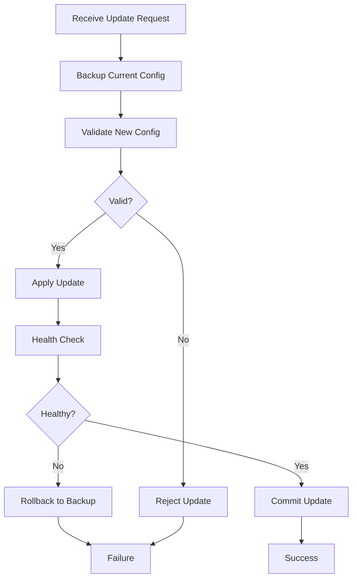

# Healdec Engine Documentation

**Healdec** is SocialAi's auto-healing orchestration engine that ensures system reliability through continuous monitoring, automatic recovery, and safe configuration management.

---

## Table of Contents

1. [Overview](#overview)
2. [Core Concepts](#core-concepts)
3. [Architecture](#architecture)
4. [Features](#features)
5. [Configuration](#configuration)
6. [Operations](#operations)
7. [Monitoring](#monitoring)
8. [Best Practices](#best-practices)

---

## Overview

Healdec (Health + Autodecrement) is a self-healing system that:

- **Monitors** system component health continuously
- **Detects** failures and performance degradation
- **Recovers** automatically from common issues
- **Validates** changes before applying them
- **Rolls back** problematic changes
- **Alerts** administrators when manual intervention is needed

### Design Philosophy

Healdec follows these principles:

1. **Fail Fast, Recover Faster**: Detect issues quickly and recover automatically
2. **Validate Before Apply**: Never apply unvalidated changes
3. **Always Have a Rollback**: Maintain ability to revert changes
4. **Monitor Everything**: Comprehensive health tracking
5. **Alert Appropriately**: Inform humans when needed, not for routine issues

---

## Core Concepts

### Health States

Components can be in one of these health states:

- **Healthy** ✅: Operating normally
- **Degraded** ⚠️: Functional but with issues
- **Unhealthy** ❌: Not functioning properly
- **Unknown** ❓: Health status cannot be determined

### Health Checks

Regular health assessments of system components:

```javascript
{
  component: "farcaster_worker",
  status: "healthy",
  timestamp: "2024-01-01T00:00:00Z",
  metrics: {
    uptime: 3600,
    lastSuccessfulRun: "2024-01-01T00:00:00Z",
    errorRate: 0.01,
    responseTime: 150
  }
}
```

### Auto-Healing Actions

Healdec can perform these automatic recovery actions:

1. **Restart**: Restart failed workers or services
2. **Rollback**: Revert configuration changes
3. **Clear Cache**: Free up memory
4. **Kill Queries**: Terminate long-running database queries
5. **Reset Connections**: Recreate connection pools
6. **Retry**: Retry failed operations with backoff

---

## Architecture



### Components

#### 1. Health Scanner

Continuously monitors system health:

```javascript
class HealdecEngine {
  async scanDependencies() {
    console.log('🔍 [Healdec] Scanning dependencies...');
    const results = [];
    
    // Check all workers
    for (const [name, worker] of Object.entries(CONFIG.workers)) {
      if (!worker.enabled) continue;
      
      const health = await this.checkWorkerHealth(name);
      results.push({ name, healthy: health });
      
      // Trigger recovery if unhealthy
      if (!health) {
        await this.triggerRecovery(name);
      }
    }
    
    return results;
  }
}
```

#### 2. Validation Manager

Validates changes before applying:

```javascript
async validate(target) {
  console.log(`✔️  [Healdec] Validating ${target}...`);
  
  // 1. Check configuration exists
  if (!CONFIG.workers[target]) {
    return false;
  }
  
  // 2. Verify file paths
  const workerPath = join(__dirname, CONFIG.workers[target].path);
  if (!fs.existsSync(workerPath)) {
    return false;
  }
  
  // 3. Check dependencies
  const deps = await this.checkDependencies(target);
  if (!deps.satisfied) {
    return false;
  }
  
  // 4. Verify database connection
  const dbHealthy = await this.checkDatabase();
  if (!dbHealthy) {
    return false;
  }
  
  return true;
}
```

#### 3. Recovery Manager

Executes recovery actions:

```javascript
async triggerRecovery(target) {
  console.log(`🔧 [Healdec] Triggering recovery for ${target}`);
  
  // Get recovery strategy based on issue type
  const strategy = this.determineRecoveryStrategy(target);
  
  switch (strategy) {
    case 'restart':
      await workerManager.restartWorker(target);
      break;
    
    case 'rollback':
      await this.rollback(target);
      break;
    
    case 'clear_cache':
      await this.clearCache(target);
      break;
    
    case 'manual':
      await this.alertAdmin(target);
      break;
  }
}
```

#### 4. Configuration Manager

Manages safe configuration updates:

```javascript
async safeUpdate(target, updateFn) {
  console.log(`🔄 [Healdec] Safe update for ${target}...`);
  
  // 1. Backup current state
  const backup = await this.backupConfig(target);
  
  // 2. Validate change
  const validated = await this.validate(target);
  if (!validated) {
    console.error(`❌ [Healdec] Validation failed for ${target}`);
    return false;
  }
  
  // 3. Apply change
  try {
    await updateFn();
    
    // 4. Verify system still healthy
    const healthy = await this.healthCheck(target);
    if (!healthy) {
      throw new Error('Health check failed after update');
    }
    
    console.log(`✅ [Healdec] Update completed for ${target}`);
    return true;
  } catch (error) {
    // 5. Rollback on failure
    console.error(`❌ [Healdec] Update failed, rolling back`);
    await this.rollback(target, backup);
    return false;
  }
}
```

#### 5. Alert Manager

Sends alerts to administrators:

```javascript
async alertAdmin(target, message) {
  const alert = {
    level: 'critical',
    component: target,
    message: message,
    timestamp: new Date().toISOString(),
    actions: ['manual_intervention_required']
  };
  
  // Store in database
  await db.query(`
    INSERT INTO alerts (level, component, message, timestamp)
    VALUES ($1, $2, $3, $4)
  `, [alert.level, alert.component, alert.message, alert.timestamp]);
  
  // Send to admin console
  await this.notifyAdminConsole(alert);
  
  // Email if critical
  if (alert.level === 'critical') {
    await this.sendEmail(alert);
  }
}
```

---

## Features

### 1. Dependency Scanning

Healdec continuously scans for:

- **Worker Health**: Process running, responsive, recent activity
- **Database Health**: Connection status, query performance
- **External APIs**: Availability, response time, rate limits
- **Resource Usage**: CPU, memory, disk, network
- **Configuration**: Valid settings, no conflicts

**Scan Interval**: Every 30 seconds (configurable)

```javascript
healdec: {
  healthCheckInterval: 30000,  // 30 seconds
  restartDelay: 5000,          // 5 seconds
  maxRestarts: 3               // Maximum restart attempts
}
```

### 2. Safe Updates

Configuration changes are applied safely:



**Example Usage**:
```javascript
// Update worker configuration
await healdec.safeUpdate('farcaster', async () => {
  CONFIG.workers.farcaster.interval = 30000;  // Change to 30 seconds
  await workerManager.restartWorker('farcaster');
});
```

### 3. Auto-Rebuild

Automatically rebuild/restart components:

```javascript
async rebuild(target) {
  console.log(`🔨 [Healdec] Rebuilding ${target}...`);
  
  // 1. Stop target
  await this.stopComponent(target);
  
  // 2. Clean resources
  await this.cleanupResources(target);
  
  // 3. Restart
  await this.startComponent(target);
  
  // 4. Verify health
  const healthy = await this.healthCheck(target);
  
  return healthy;
}
```

### 4. Validation Checks

Multi-layered validation:

```javascript
async validate(target) {
  const checks = [
    this.validateConfiguration,
    this.validateDependencies,
    this.validateResources,
    this.validatePermissions,
    this.validateConnections
  ];
  
  for (const check of checks) {
    const result = await check(target);
    if (!result.valid) {
      console.error(`Validation failed: ${result.reason}`);
      return false;
    }
  }
  
  return true;
}
```

### 5. Automatic Rollback

Revert failed changes:

```javascript
async rollback(target, backup) {
  console.log(`↩️  [Healdec] Rolling back ${target}...`);
  
  try {
    // 1. Stop current state
    await this.stopComponent(target);
    
    // 2. Restore backup configuration
    CONFIG.workers[target] = backup;
    
    // 3. Restart with old config
    await this.startComponent(target);
    
    // 4. Verify rollback successful
    const healthy = await this.healthCheck(target);
    
    if (healthy) {
      console.log(`✅ [Healdec] Rollback successful for ${target}`);
    } else {
      console.error(`❌ [Healdec] Rollback failed for ${target}`);
      await this.alertAdmin(target, 'Rollback failed');
    }
    
    return healthy;
  } catch (error) {
    console.error(`❌ [Healdec] Rollback error:`, error);
    return false;
  }
}
```

### 6. Health Monitoring

Comprehensive health tracking:

```javascript
async checkWorkerHealth(workerName) {
  const health = {
    name: workerName,
    healthy: false,
    checks: {}
  };
  
  // Check if process is running
  const worker = workerManager.workers.get(workerName);
  health.checks.processRunning = worker !== undefined;
  
  // Check last successful run
  const lastRun = await this.getLastSuccessfulRun(workerName);
  const timeSinceLastRun = Date.now() - lastRun;
  health.checks.recentActivity = timeSinceLastRun < 300000; // 5 minutes
  
  // Check error rate
  const errorRate = await this.getErrorRate(workerName);
  health.checks.lowErrorRate = errorRate < 0.05; // Less than 5%
  
  // Overall health
  health.healthy = Object.values(health.checks).every(c => c === true);
  
  return health;
}
```

---

## Configuration

### Environment Variables

```bash
# Healdec Configuration
HEALDEC_HEALTH_CHECK_INTERVAL=30000      # Health check frequency (ms)
HEALDEC_RESTART_DELAY=5000               # Delay before restart (ms)
HEALDEC_MAX_RESTARTS=3                   # Max restart attempts
HEALDEC_ALERT_EMAIL=admin@socialai.com   # Alert email address
HEALDEC_ENABLE_AUTO_FIX=true             # Enable automatic fixes
```

### Configuration Object

```javascript
const HEALDEC_CONFIG = {
  // Health monitoring
  healthCheckInterval: 30000,
  componentChecks: {
    workers: true,
    database: true,
    api: true,
    external: true
  },
  
  // Recovery
  autoRestart: true,
  restartDelay: 5000,
  maxRestarts: 3,
  backoffMultiplier: 2,
  resetInterval: 3600000,  // Reset restart count after 1 hour
  
  // Validation
  validateBeforeUpdate: true,
  requireHealthCheckAfterUpdate: true,
  
  // Rollback
  autoRollback: true,
  keepBackups: 5,
  
  // Alerting
  alertOnFailure: true,
  alertOnMaxRestarts: true,
  alertEmail: process.env.HEALDEC_ALERT_EMAIL,
  
  // Logging
  logLevel: 'info',
  logToDatabase: true,
  logToFile: false
};
```

### Feature Flags

Control Healdec behavior via feature flags:

```sql
INSERT INTO feature_flags (flag_name, enabled, description) VALUES
  ('healdec_auto_restart', true, 'Enable automatic worker restarts'),
  ('healdec_auto_rollback', true, 'Enable automatic rollback on failure'),
  ('healdec_alerts', true, 'Enable Healdec alerting'),
  ('healdec_validation', true, 'Enable validation before updates');
```

---

## Operations

### Starting Healdec

Healdec starts automatically with the backend:

```javascript
// In node/socialai.node.js
const healdec = new HealdecEngine();
const workerManager = new WorkerManager();

// Start worker manager
await workerManager.startWorkers();

// Start health monitoring
healdec.startMonitoring();
```

### Manual Operations

#### Trigger Health Check

```javascript
// Via Admin Console or API
POST /api/healdec/health-check

// Response
{
  "status": "healthy",
  "components": [
    { "name": "farcaster", "healthy": true },
    { "name": "ai", "healthy": true }
  ]
}
```

#### Restart Component

```javascript
// Via Admin Console or API
POST /api/healdec/restart
{
  "component": "farcaster"
}
```

#### Validate Configuration

```javascript
// Via Admin Console or API
POST /api/healdec/validate
{
  "component": "farcaster",
  "config": { ... }
}
```

### Monitoring Dashboard

Access Healdec status in Admin Console:

**URL**: http://localhost:4200/healdec

**Features**:
- Real-time health status
- Component health history
- Recent recovery actions
- Alert history
- Manual controls

---

## Monitoring

### Health Metrics

Track these key metrics:

- **Uptime**: Component uptime percentage
- **MTBF**: Mean time between failures
- **MTTR**: Mean time to recovery
- **Error Rate**: Percentage of failed operations
- **Recovery Rate**: Percentage of successful automatic recoveries

### Logs

Healdec logs all actions:

```
🔍 [Healdec] Scanning dependencies...
✅ [Healdec] All components healthy
⚠️  [Healdec] Worker farcaster unhealthy, attempting restart...
🔄 [Healdec] Restarting farcaster worker...
✅ [Healdec] farcaster worker restarted successfully
```

**Log Levels**:
- **INFO** 📘: Normal operations
- **WARN** ⚠️: Issues detected, auto-fixing
- **ERROR** ❌: Auto-fix failed
- **CRITICAL** 🚨: System stability at risk

### Alerts

Healdec generates alerts for:

1. **Component Failures** (immediate)
2. **Max Restarts Reached** (manual intervention needed)
3. **Validation Failures** (configuration issues)
4. **Rollback Required** (update failed)
5. **Resource Exhaustion** (system limits reached)

**Alert Channels**:
- Admin Console (real-time)
- Email (critical alerts)
- Database (persistent log)
- Webhooks (integrations)

---

## Best Practices

### 1. Configure Appropriate Thresholds

```javascript
// Too aggressive (may restart too often)
maxRestarts: 10,
restartDelay: 1000

// Too conservative (slow recovery)
maxRestarts: 1,
restartDelay: 60000

// Recommended (balanced)
maxRestarts: 3,
restartDelay: 5000
```

### 2. Monitor Recovery Success Rate

Track how often auto-recovery succeeds:

```sql
SELECT 
  DATE(timestamp) as date,
  COUNT(*) as total_recoveries,
  SUM(CASE WHEN success THEN 1 ELSE 0 END) as successful,
  AVG(CASE WHEN success THEN 1 ELSE 0 END) * 100 as success_rate
FROM healdec_actions
WHERE action = 'restart'
GROUP BY DATE(timestamp)
ORDER BY date DESC;
```

**Target**: >90% success rate

### 3. Review Failed Recoveries

Investigate when auto-recovery fails:

```sql
SELECT *
FROM healdec_actions
WHERE action = 'restart'
  AND success = false
ORDER BY timestamp DESC
LIMIT 10;
```

### 4. Test Rollback Procedures

Periodically test rollback:

```bash
# Apply test configuration change
curl -X POST http://localhost:3000/api/healdec/update \
  -d '{"component": "test", "config": {...}}'

# Trigger rollback
curl -X POST http://localhost:3000/api/healdec/rollback \
  -d '{"component": "test"}'
```

### 5. Maintain Alert Hygiene

- **Review alerts weekly** to identify patterns
- **Tune thresholds** to reduce noise
- **Update alert recipients** as team changes
- **Document resolution procedures** for common alerts

### 6. Regular Health Audits

Run comprehensive health checks:

```bash
# Generate health report
curl http://localhost:3000/api/healdec/health-report > health-$(date +%Y%m%d).json

# Review report
cat health-$(date +%Y%m%d).json | jq '.components[] | select(.healthy == false)'
```

### 7. Keep Backups

Healdec maintains configuration backups:

- **Backup before each change**
- **Keep last 5 backups**
- **Store backups in database**
- **Test backup restoration**

---

**Document Version**: 1.0  
**Last Updated**: February 2026  
**Status**: Complete
