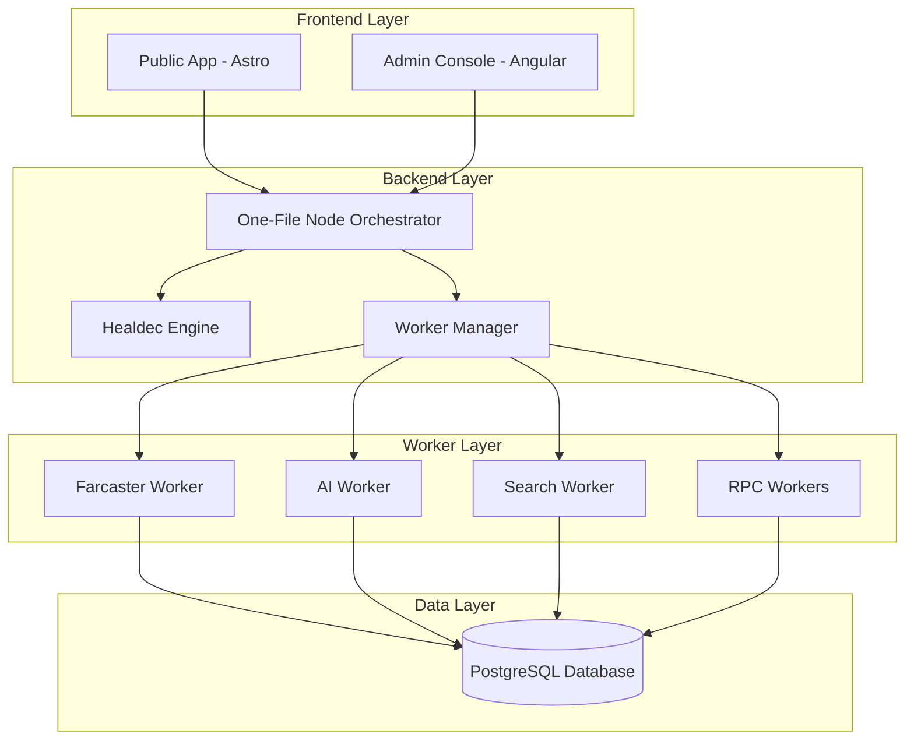

# SocialAi Documentation

Welcome to the comprehensive documentation for **SocialAi**, the open social index and identity claim network built on a parallel, auto-healing, one-file node architecture powered by Healdec and SmartBrain.

---

## 📚 Table of Contents

### Getting Started
- [Installation Guide](INSTALLATION.md) - Complete setup and deployment instructions
- [Quick Start](#quick-start) - Get up and running in 5 minutes

### Architecture & Design
- [System Architecture](ARCHITECTURE.md) - Detailed system design and component diagrams
- [UI/UX Specifications](UIUXSPECTS.md) - User interface and experience guidelines
- [API Reference](API.md) - Complete REST API documentation

### Core Features
- [Auto Sync](FEATURES.md#auto-sync) - Automatic data synchronization from external sources
- [Auto Test](FEATURES.md#auto-test) - Automated health checking and validation
- [Auto Analysis](FEATURES.md#auto-analysis) - AI-powered content analysis and insights
- [Auto Fix](FEATURES.md#auto-fix) - Self-healing system recovery and maintenance

### Advanced Topics
- [Worker System](WORKERS.md) - Parallel worker orchestration and management
- [Healdec Engine](HEALDEC.md) - Auto-healing engine documentation
- [SmartBrain Integration](SMARTBRAIN.md) - AI features and embeddings

### Operations
- [Deployment Guide](DEPLOYMENT.md) - Production deployment instructions
- [Troubleshooting](TROUBLESHOOTING.md) - Common issues and solutions
- [Performance Tuning](PERFORMANCE.md) - Optimization guidelines

### Development
- [Contributing Guidelines](CONTRIBUTING.md) - How to contribute to the project
- [Development Workflow](DEVELOPMENT.md) - Local development setup and practices
- [Testing Guide](TESTING.md) - Testing strategies and best practices

---

## 🚀 Quick Start

Get SocialAi running on your local machine in just a few steps:

### Prerequisites
- Node.js 18 or higher
- PostgreSQL 14 or higher
- Git

### Installation Steps

```bash
# 1. Clone the repository
git clone https://github.com/SolanaRemix/SocialAi.git
cd SocialAi

# 2. Install dependencies
npm install

# 3. Setup database
createdb socialai
psql -U postgres -d socialai -f db/schema.sql

# 4. Configure environment
cp .env.example .env
# Edit .env with your settings

# 5. Start the system
npm run dev                # Backend + Workers
npm run dev:public         # Public App (http://localhost:4321)
npm run dev:admin          # Admin Console (http://localhost:4200)
```

### Access Points
- 🔌 **Backend API**: http://localhost:3000
- 🌐 **Public App**: http://localhost:4321
- ⚙️ **Admin Console**: http://localhost:4200

---

## 🎯 What is SocialAi?

SocialAi is a lightweight, AI-powered social discovery engine that:

- **Indexes social activity** from Farcaster, Reddit, and other networks
- **Provides SEO-optimized profiles** that are Google-indexable
- **Enables identity claims** through Farcaster Sign-In and wallet verification
- **Powers AI features** with embeddings, summaries, and recommendations
- **Self-heals automatically** using the Healdec engine
- **Runs efficiently** with a one-file node orchestrator

---

## 🏗️ System Architecture Overview



**Key Components:**
- **Frontend**: Astro (public) + Angular (admin)
- **Backend**: One-file node orchestrator with Healdec
- **Workers**: Parallel processing for sync, AI, search, and blockchain
- **Database**: PostgreSQL with vector extensions

---

## ✨ Core Features

### 🔄 Auto Sync
Automatically synchronizes data from external sources:
- Farcaster Hub casts and user data
- Reddit posts and comments
- Blockchain data (Ethereum, BASE, Solana)
- Configurable sync intervals
- Feature flag controls

[Learn more about Auto Sync →](FEATURES.md#auto-sync)

### 🔍 Auto Test
Continuous health monitoring and validation:
- Worker health checks every 30 seconds
- Dependency scanning
- Configuration validation
- Performance monitoring
- Alert generation

[Learn more about Auto Test →](FEATURES.md#auto-test)

### 🧠 Auto Analysis
AI-powered content processing:
- Vector embeddings generation
- Topic clustering
- Content summaries
- User recommendations
- Sentiment analysis

[Learn more about Auto Analysis →](FEATURES.md#auto-analysis)

### 🔧 Auto Fix
Self-healing system capabilities:
- Automatic worker restarts
- Safe configuration updates
- Validation before changes
- Automatic rollback on failure
- Graceful degradation

[Learn more about Auto Fix →](FEATURES.md#auto-fix)

---

## 📖 Documentation Categories

### For Users
- **[Installation Guide](INSTALLATION.md)**: Setup instructions
- **User Guide**: Coming soon
- **[API Reference](API.md)**: REST API documentation

### For Administrators
- **Admin Console Guide**: Coming soon
- **Feature Flags**: See [FEATURES.md](FEATURES.md#configuration)
- **Monitoring**: See [Healdec Monitoring](HEALDEC.md#monitoring)
- **[Troubleshooting](TROUBLESHOOTING.md)**: Solving common issues

### For Developers
- **[Architecture](ARCHITECTURE.md)**: System design details
- **[Worker System](WORKERS.md)**: Worker development guide
- **Contributing**: Coming soon
- **Development Setup**: See [INSTALLATION.md](INSTALLATION.md)

### For DevOps
- **Deployment**: See [INSTALLATION.md](INSTALLATION.md#production-deployment)
- **Performance**: See [Troubleshooting](TROUBLESHOOTING.md#performance-issues)
- **[Security](../SECURITY.md)**: Security best practices (see root directory)
- **Backup & Recovery**: See database backup procedures in installation guide

---

## 🔗 Useful Links

- **GitHub Repository**: [SolanaRemix/SocialAi](https://github.com/SolanaRemix/SocialAi)
- **License**: [MIT License](../LICENSE)
- **Report Issues**: [GitHub Issues](https://github.com/SolanaRemix/SocialAi/issues)
- **Discussions**: [GitHub Discussions](https://github.com/SolanaRemix/SocialAi/discussions)

---

## 🤝 Getting Help

Need assistance? Here are the best ways to get help:

1. **Documentation**: Start with the guides above
2. **Troubleshooting**: Check [TROUBLESHOOTING.md](TROUBLESHOOTING.md)
3. **Issues**: Search [existing issues](https://github.com/SolanaRemix/SocialAi/issues)
4. **Community**: Join our [discussions](https://github.com/SolanaRemix/SocialAi/discussions)

---

## 📝 Documentation Standards

This documentation follows these principles:

- **Clear and Concise**: Easy to understand language
- **Well-Organized**: Logical structure with table of contents
- **Comprehensive**: Covers all features and use cases
- **Up-to-Date**: Regularly maintained and reviewed
- **Accessible**: WCAG 2.1 AA compliant where applicable
- **Searchable**: Optimized for quick information retrieval

---

## 🔄 Recent Updates

**Version 1.0** - February 2026
- Complete documentation overhaul
- Added Auto Sync, Auto Test, Auto Analysis, and Auto Fix feature documentation
- Worker System comprehensive guide
- Healdec Engine documentation
- SmartBrain AI integration guide
- Troubleshooting guide with common solutions
- Enhanced API and Installation documentation

For a complete change history, see commit log on GitHub.

---

## 📄 License

SocialAi is licensed under the MIT License. See [LICENSE](../LICENSE) for details.

---

**Version**: 1.0  
**Last Updated**: February 2026  
**Status**: Active Development
