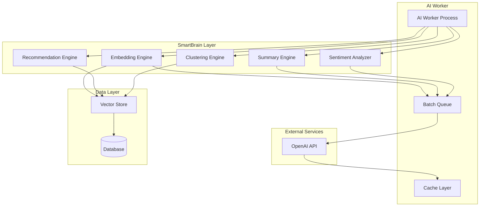

# SmartBrain Integration Documentation

**SmartBrain** is SocialAi's AI-powered intelligence layer that provides semantic understanding, content analysis, and personalized recommendations using advanced machine learning models.

---

## Table of Contents

1. [Overview](#overview)
2. [Architecture](#architecture)
3. [Features](#features)
4. [Vector Embeddings](#vector-embeddings)
5. [Content Analysis](#content-analysis)
6. [Recommendations](#recommendations)
7. [Configuration](#configuration)
8. [API Integration](#api-integration)
9. [Performance Optimization](#performance-optimization)
10. [Best Practices](#best-practices)

---

## Overview

SmartBrain integrates artificial intelligence capabilities throughout SocialAi:

- **Vector Embeddings**: Semantic representation of content
- **Content Summaries**: AI-generated summaries of posts and threads
- **Topic Clustering**: Automatic content categorization
- **User Recommendations**: Personalized profile suggestions
- **Sentiment Analysis**: Emotional tone detection
- **Trend Detection**: Emerging topic identification
- **Profile Optimization**: AI-assisted profile enhancement

### Technology Stack

- **Current implementation**: In-process content analysis (e.g., string operations and SQL queries) without external AI APIs or vector search
- **Database**: PostgreSQL for storing posts, profiles, and analytics
- **Planned integration**: OpenAI API (for advanced text generation and embeddings) and PostgreSQL pgvector (for semantic vector search and recommendations)
- **Processing model**: Batch-friendly worker pattern for future AI/embedding jobs

---

## Architecture



### Components

1. **AI Worker**: Background process for AI tasks
2. **Embedding Engine**: Generates vector embeddings
3. **Summary Engine**: Creates content summaries
4. **Clustering Engine**: Groups similar content
5. **Recommendation Engine**: Suggests relevant content/users
6. **Sentiment Analyzer**: Detects emotional tone

---

## Features

### 1. Semantic Search

Find content by meaning, not just keywords:

```javascript
// Search for posts similar to a query
async function semanticSearch(query, limit = 10) {
  // 1. Generate embedding for query
  const queryEmbedding = await generateEmbedding(query);
  
  // 2. Find similar posts using vector similarity
  const results = await db.query(`
    SELECT 
      p.id,
      p.content,
      1 - (e.embedding <=> $1) as similarity
    FROM posts p
    JOIN embeddings e ON e.content_id = p.id
    WHERE e.content_type = 'post'
    ORDER BY e.embedding <=> $1
    LIMIT $2
  `, [queryEmbedding, limit]);
  
  return results.rows;
}
```

### 2. Content Discovery

Discover related content automatically:

```javascript
// Find posts related to a given post
async function findRelatedPosts(postId, limit = 5) {
  const results = await db.query(`
    SELECT 
      p2.id,
      p2.content,
      1 - (e1.embedding <=> e2.embedding) as similarity
    FROM embeddings e1
    JOIN embeddings e2 ON e2.content_type = 'post'
    JOIN posts p2 ON p2.id = e2.content_id
    WHERE e1.content_id = $1
      AND e1.content_type = 'post'
      AND e2.content_id != $1
    ORDER BY e1.embedding <=> e2.embedding
    LIMIT $2
  `, [postId, limit]);
  
  return results.rows;
}
```

### 3. Profile Matching

Match users with similar interests:

```javascript
// Find similar profiles
async function findSimilarProfiles(userId, limit = 10) {
  const results = await db.query(`
    SELECT 
      p2.id,
      p2.username,
      p2.display_name,
      1 - (e1.embedding <=> e2.embedding) as similarity
    FROM embeddings e1
    JOIN embeddings e2 ON e2.content_type = 'profile'
    JOIN profiles p2 ON p2.id = e2.content_id
    WHERE e1.content_id = $1
      AND e1.content_type = 'profile'
      AND e2.content_id != $1
    ORDER BY e1.embedding <=> e2.embedding
    LIMIT $2
  `, [userId, limit]);
  
  return results.rows;
}
```

### 4. Intelligent Feeds

Personalized content feeds:

```javascript
// Generate personalized feed
async function generatePersonalizedFeed(userId, limit = 20) {
  // 1. Get user's interests (from liked posts)
  const userInterests = await getUserInterestEmbedding(userId);
  
  // 2. Find posts matching interests
  const posts = await db.query(`
    SELECT 
      p.id,
      p.content,
      p.created_at,
      1 - (e.embedding <=> $1) as relevance
    FROM posts p
    JOIN embeddings e ON e.content_id = p.id
    WHERE e.content_type = 'post'
      AND p.created_at > NOW() - INTERVAL '7 days'
    ORDER BY 
      (1 - (e.embedding <=> $1)) * 0.7 +  -- Relevance: 70%
      (EXTRACT(EPOCH FROM (NOW() - p.created_at)) / 86400) * 0.3  -- Recency: 30%
    DESC
    LIMIT $2
  `, [userInterests, limit]);
  
  return posts.rows;
}
```

---

## Vector Embeddings

### What Are Embeddings?

Embeddings are high-dimensional vector representations of text that capture semantic meaning. Similar content produces similar vectors.

**Dimensions**: 1536 (OpenAI text-embedding-ada-002)

**Example**:
```
Text: "blockchain technology"
Embedding: [0.123, -0.456, 0.789, ..., 0.234]  (1536 dimensions)

Text: "distributed ledger"  (similar meaning)
Embedding: [0.145, -0.423, 0.812, ..., 0.267]  (similar vector)
```

### Generation Process

```javascript
async function generateEmbedding(text) {
  // 1. Clean and normalize text
  const cleanText = text
    .trim()
    .replace(/\s+/g, ' ')
    .substring(0, 8000);  // OpenAI limit: 8191 tokens
  
  // 2. Call OpenAI API
  const response = await openai.embeddings.create({
    model: "text-embedding-ada-002",
    input: cleanText
  });
  
  // 3. Extract embedding vector
  const embedding = response.data[0].embedding;
  
  return embedding;
}
```

### Storage

Embeddings are stored in PostgreSQL with pgvector:

```sql
-- Create embeddings table
CREATE TABLE embeddings (
    id UUID PRIMARY KEY DEFAULT gen_random_uuid(),
    content_id UUID NOT NULL,
    content_type VARCHAR(50) NOT NULL,
    embedding vector(1536),  -- pgvector type
    metadata JSONB,
    created_at TIMESTAMP DEFAULT CURRENT_TIMESTAMP,
    
    -- Indexes for efficient similarity search
    INDEX idx_embeddings_content (content_id, content_type),
    INDEX idx_embeddings_vector ON embeddings USING ivfflat (embedding vector_cosine_ops)
);
```

### Similarity Search

Find similar vectors using cosine similarity:

```sql
-- Find posts similar to a given post
SELECT 
  p.id,
  p.content,
  1 - (e1.embedding <=> e2.embedding) as similarity
FROM embeddings e1
CROSS JOIN embeddings e2
JOIN posts p ON p.id = e2.content_id
WHERE e1.content_id = 'post-id-here'
  AND e1.content_type = 'post'
  AND e2.content_type = 'post'
  AND e2.content_id != e1.content_id
ORDER BY e1.embedding <=> e2.embedding
LIMIT 10;
```

**Operators**:
- `<=>`: Cosine distance (0 = identical, 2 = opposite)
- `<#>`: Negative inner product
- `<->`: Euclidean distance

### Batch Processing

Generate embeddings efficiently:

```javascript
async function batchGenerateEmbeddings() {
  // 1. Fetch posts without embeddings
  const posts = await db.query(`
    SELECT p.id, p.content 
    FROM posts p
    LEFT JOIN embeddings e ON e.content_id = p.id AND e.content_type = 'post'
    WHERE e.id IS NULL
    LIMIT 10
  `);
  
  // 2. Generate embeddings (can batch API calls)
  for (const post of posts.rows) {
    const embedding = await generateEmbedding(post.content);
    
    // 3. Store embedding
    await db.query(`
      INSERT INTO embeddings (content_id, content_type, embedding, metadata)
      VALUES ($1, $2, $3, $4)
    `, [
      post.id,
      'post',
      JSON.stringify(embedding),
      { length: post.content.length }
    ]);
  }
  
  console.log(`Generated ${posts.rows.length} embeddings`);
}
```

---

## Content Analysis

### Summaries

Generate concise summaries of long content:

```javascript
async function generateSummary(postId) {
  // 1. Fetch post content
  const post = await getPost(postId);
  
  // 2. Call GPT API
  const response = await openai.chat.completions.create({
    model: "gpt-4",
    messages: [
      {
        role: "system",
        content: "You are a helpful assistant that summarizes social media posts concisely."
      },
      {
        role: "user",
        content: `Summarize this post in one sentence (50-100 characters):\n\n${post.content}`
      }
    ],
    max_tokens: 50,
    temperature: 0.3
  });
  
  const summary = response.choices[0].message.content;
  
  // 3. Store summary
  await db.query(`
    UPDATE posts SET summary = $1 WHERE id = $2
  `, [summary, postId]);
  
  return summary;
}
```

### Topic Extraction

Extract key topics from content:

```javascript
async function extractTopics(content) {
  const response = await openai.chat.completions.create({
    model: "gpt-3.5-turbo",
    messages: [
      {
        role: "system",
        content: "Extract 3-5 key topics from the text. Return as JSON array."
      },
      {
        role: "user",
        content: content
      }
    ],
    temperature: 0.5
  });
  
  const topics = JSON.parse(response.choices[0].message.content);
  return topics;
}
```

### Sentiment Analysis

Detect emotional tone:

```javascript
async function analyzeSentiment(content) {
  const response = await openai.chat.completions.create({
    model: "gpt-3.5-turbo",
    messages: [
      {
        role: "system",
        content: "Analyze sentiment. Respond with: positive, neutral, or negative."
      },
      {
        role: "user",
        content: content
      }
    ],
    max_tokens: 10,
    temperature: 0
  });
  
  const sentiment = response.choices[0].message.content.toLowerCase();
  
  // Map to score
  const scores = {
    'positive': 1,
    'neutral': 0,
    'negative': -1
  };
  
  return {
    sentiment: sentiment,
    score: scores[sentiment] || 0
  };
}
```

---

## Recommendations

### User Recommendations

Suggest users to follow:

```javascript
async function recommendUsers(userId, limit = 10) {
  // 1. Get user's profile embedding
  const userEmbedding = await getProfileEmbedding(userId);
  
  // 2. Find similar profiles
  const similar = await db.query(`
    SELECT 
      p.id,
      p.username,
      p.display_name,
      p.bio,
      1 - (e.embedding <=> $1) as similarity
    FROM profiles p
    JOIN embeddings e ON e.content_id = p.id
    WHERE e.content_type = 'profile'
      AND p.id != $2
      AND p.id NOT IN (
        SELECT following_id FROM follows WHERE follower_id = $2
      )
    ORDER BY e.embedding <=> $1
    LIMIT $3
  `, [userEmbedding, userId, limit * 2]);
  
  // 3. Rank by multiple factors
  const ranked = similar.rows.map(profile => {
    // Calculate weighted score
    const score = 
      profile.similarity * 0.5 +           // Profile similarity: 50%
      getMutualFollows(userId, profile.id) * 0.3 +  // Mutual follows: 30%
      getEngagementScore(profile.id) * 0.2;         // Engagement: 20%
    
    return { ...profile, score };
  });
  
  // 4. Sort and return top results
  return ranked
    .sort((a, b) => b.score - a.score)
    .slice(0, limit);
}
```

### Content Recommendations

Suggest posts users might like:

```javascript
async function recommendPosts(userId, limit = 20) {
  // 1. Get user's interest vector (from liked posts)
  const interests = await getUserInterestVector(userId);
  
  // 2. Find matching posts
  const posts = await db.query(`
    SELECT 
      p.id,
      p.content,
      p.created_at,
      p.like_count,
      1 - (e.embedding <=> $1) as relevance
    FROM posts p
    JOIN embeddings e ON e.content_id = p.id
    WHERE e.content_type = 'post'
      AND p.id NOT IN (
        SELECT post_id FROM likes WHERE user_id = $2
      )
      AND p.created_at > NOW() - INTERVAL '7 days'
    ORDER BY 
      (1 - (e.embedding <=> $1)) * 0.5 +  -- Relevance: 50%
      (p.like_count / 100.0) * 0.3 +      -- Popularity: 30%
      (7 - EXTRACT(DAY FROM (NOW() - p.created_at))) / 7 * 0.2  -- Recency: 20%
    DESC
    LIMIT $3
  `, [interests, userId, limit]);
  
  return posts.rows;
}
```

### Trending Topics

Identify emerging topics:

```javascript
async function detectTrendingTopics(timeWindow = '24 hours') {
  // 1. Get recent posts
  const recentPosts = await db.query(`
    SELECT id, content, created_at
    FROM posts
    WHERE created_at > NOW() - INTERVAL $1
  `, [timeWindow]);
  
  // 2. Cluster posts by similarity
  const clusters = await clusterPosts(recentPosts.rows);
  
  // 3. Identify largest/fastest-growing clusters
  const trending = clusters
    .map(cluster => ({
      topic: cluster.centroid,
      postCount: cluster.posts.length,
      growthRate: calculateGrowthRate(cluster.posts),
      representative: cluster.posts[0]
    }))
    .sort((a, b) => b.growthRate - a.growthRate)
    .slice(0, 10);
  
  return trending;
}
```

---

## Configuration

### Environment Variables

```bash
# OpenAI Configuration
OPENAI_API_KEY=sk-...
OPENAI_MODEL=gpt-4
OPENAI_EMBEDDING_MODEL=text-embedding-ada-002
OPENAI_MAX_TOKENS=1000
OPENAI_TEMPERATURE=0.7

# SmartBrain Settings
SMARTBRAIN_BATCH_SIZE=10
SMARTBRAIN_CACHE_TTL=3600
SMARTBRAIN_RATE_LIMIT=60
```

### Feature Flags

Control SmartBrain features:

```json
{
  "ai_embeddings": true,
  "ai_summaries": true,
  "ai_recommendations": true,
  "ai_sentiment": false,
  "ai_topic_extraction": true,
  "ai_trending": true
}
```

### Rate Limits

Manage API usage:

```javascript
const RATE_LIMITS = {
  embeddings: {
    requestsPerMinute: 3000,
    tokensPerMinute: 1000000
  },
  completions: {
    requestsPerMinute: 500,
    tokensPerMinute: 150000
  }
};
```

---

## API Integration

### REST Endpoints

#### Get Post Summary
```
GET /api/ai/summary/:postId
```

**Response**:
```json
{
  "summary": "This post discusses the future of decentralized social media.",
  "topics": ["web3", "social", "decentralization"],
  "sentiment": "positive"
}
```

#### Get Recommendations
```
GET /api/ai/recommendations/:userId
```

**Response**:
```json
[
  {
    "id": "uuid",
    "username": "alice",
    "display_name": "Alice",
    "similarity": 0.87,
    "reason": "Similar interests in web3 and AI"
  }
]
```

#### Search Content
```
POST /api/ai/search
{
  "query": "blockchain scalability solutions",
  "limit": 10
}
```

**Response**:
```json
[
  {
    "id": "uuid",
    "content": "Post content...",
    "similarity": 0.92
  }
]
```

---

## Performance Optimization

### 1. Caching

Cache frequently accessed embeddings:

```javascript
const embeddingCache = new Map();
const CACHE_TTL = 3600000;  // 1 hour

async function getCachedEmbedding(contentId) {
  const cached = embeddingCache.get(contentId);
  
  if (cached && Date.now() - cached.timestamp < CACHE_TTL) {
    return cached.embedding;
  }
  
  const embedding = await fetchEmbedding(contentId);
  embeddingCache.set(contentId, {
    embedding,
    timestamp: Date.now()
  });
  
  return embedding;
}
```

### 2. Batch API Calls

Process multiple items in one request:

```javascript
async function batchGenerateEmbeddings(texts) {
  // OpenAI supports up to 2048 texts per request
  const chunks = chunkArray(texts, 2048);
  const allEmbeddings = [];
  
  for (const chunk of chunks) {
    const response = await openai.embeddings.create({
      model: "text-embedding-ada-002",
      input: chunk
    });
    
    allEmbeddings.push(...response.data.map(d => d.embedding));
  }
  
  return allEmbeddings;
}
```

### 3. Async Processing

Use queue for non-urgent tasks:

```javascript
// Queue embedding generation
async function queueEmbeddingGeneration(contentId) {
  await db.query(`
    INSERT INTO ai_queue (task_type, content_id, priority)
    VALUES ('embedding', $1, 'normal')
  `, [contentId]);
}

// Process queue in background
async function processQueue() {
  const tasks = await db.query(`
    SELECT * FROM ai_queue
    WHERE status = 'pending'
    ORDER BY priority DESC, created_at ASC
    LIMIT 10
  `);
  
  for (const task of tasks.rows) {
    await processTask(task);
  }
}
```

### 4. Index Optimization

Use appropriate vector indexes:

```sql
-- IVFFlat index (good for large datasets)
CREATE INDEX idx_embeddings_ivfflat 
ON embeddings USING ivfflat (embedding vector_cosine_ops)
WITH (lists = 100);

-- HNSW index (better accuracy, more memory)
CREATE INDEX idx_embeddings_hnsw
ON embeddings USING hnsw (embedding vector_cosine_ops)
WITH (m = 16, ef_construction = 64);
```

---

## Best Practices

### 1. Cost Management

Monitor API usage:

```javascript
// Track token usage
let totalTokens = 0;
const MONTHLY_BUDGET = 100000;  // tokens

async function callWithBudget(apiCall) {
  if (totalTokens >= MONTHLY_BUDGET) {
    throw new Error('Monthly budget exceeded');
  }
  
  const response = await apiCall();
  totalTokens += response.usage.total_tokens;
  
  return response;
}
```

### 2. Error Handling

Graceful degradation:

```javascript
async function getRecommendationsWithFallback(userId) {
  try {
    // Try AI-powered recommendations
    return await getAIRecommendations(userId);
  } catch (error) {
    console.error('AI recommendations failed:', error);
    
    // Fallback to simple recommendations
    return await getSimpleRecommendations(userId);
  }
}
```

### 3. Quality Control

Validate AI outputs:

```javascript
async function validateSummary(summary) {
  // Check length
  if (summary.length < 10 || summary.length > 200) {
    return false;
  }
  
  // Check for harmful content
  if (containsProhibitedContent(summary)) {
    return false;
  }
  
  // Check relevance (basic heuristic)
  if (!isRelevant(summary)) {
    return false;
  }
  
  return true;
}
```

### 4. Regular Maintenance

Keep embeddings up-to-date:

```javascript
// Re-generate embeddings for updated content
async function refreshEmbeddings() {
  await db.query(`
    DELETE FROM embeddings e
    WHERE e.content_type = 'post'
      AND e.created_at < (
        SELECT updated_at FROM posts p WHERE p.id = e.content_id
      )
  `);
  
  // Regenerate missing embeddings
  await batchGenerateEmbeddings();
}
```

---

**Document Version**: 1.0  
**Last Updated**: February 2026  
**Status**: Complete
