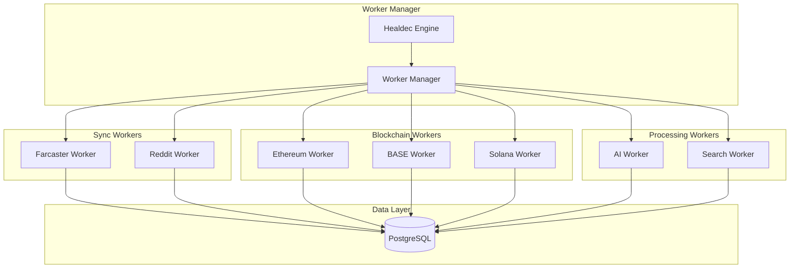

# Worker System Documentation

This document provides comprehensive information about SocialAi's parallel worker architecture, including worker types, orchestration, development guidelines, and best practices.

---

## Table of Contents

1. [Overview](#overview)
2. [Worker Architecture](#worker-architecture)
3. [Worker Types](#worker-types)
4. [Worker Manager](#worker-manager)
5. [Worker Lifecycle](#worker-lifecycle)
6. [Development Guide](#development-guide)
7. [Monitoring & Debugging](#monitoring--debugging)
8. [Best Practices](#best-practices)

---

## Overview

SocialAi uses a parallel worker architecture where independent processes handle specific tasks like data synchronization, AI processing, and search indexing. This design provides:

- **Isolation**: Worker failures don't affect other components
- **Scalability**: Workers can scale independently
- **Maintainability**: Simple, focused codebases
- **Reliability**: Auto-restart on failure
- **Performance**: Parallel processing of tasks

### Key Characteristics

- **Process-based**: Each worker runs in a separate Node.js process
- **Database-driven**: Workers communicate through the database
- **Stateless**: Workers don't maintain in-memory state
- **Auto-managed**: Worker Manager handles lifecycle
- **Health-monitored**: Healdec tracks worker health

---

## Worker Architecture



### Communication Patterns

Workers use **database-mediated communication**:

1. **Direct Database Access**: Workers read/write directly to database
2. **Feature Flags**: Workers check flags to enable/disable features
3. **Settings Table**: Dynamic configuration via database
4. **No IPC**: Workers don't communicate with each other
5. **No Message Queue**: Simple, stateless architecture

This approach provides:
- ✅ Simplicity (no complex message broker)
- ✅ Reliability (database is source of truth)
- ✅ Observability (all state visible in database)
- ⚠️ Trade-off: Slightly higher database load

---

## Worker Types

### 1. Farcaster Worker

**Purpose**: Sync data from Farcaster Hub

**Responsibilities**:
- Fetch casts (posts) from Farcaster Hub
- Sync user profiles
- Track reactions and interactions
- Update follow relationships

**Configuration**:
```javascript
{
  enabled: true,
  path: '../workers/farcaster.worker.js',
  interval: 60000,  // 1 minute
  hub_url: process.env.FARCASTER_HUB_URL
}
```

**Key Methods**:
- `syncCasts()`: Fetch and store casts
- `syncUsers()`: Update user profiles
- `syncReactions()`: Track likes/recasts
- `syncFollows()`: Update social graph

**Database Tables**:
- `external_posts`: Stores synced casts
- `profiles`: Updates Farcaster profiles
- `follows`: Social graph data

### 2. Reddit Worker

**Purpose**: Sync posts and comments from Reddit

**Responsibilities**:
- Fetch posts from configured subreddits
- Sync comments and discussions
- Track user activity
- Monitor trending content

**Configuration**:
```javascript
{
  enabled: false,  // Disabled by default
  path: '../workers/reddit.worker.js',
  interval: 120000,  // 2 minutes
  subreddits: ['ethereum', 'web3', 'cryptocurrency']
}
```

**API Requirements**:
- Reddit API credentials (client_id, client_secret)
- OAuth2 token management
- Rate limit handling (60 requests/minute)

### 3. Ethereum Worker

**Purpose**: Monitor Ethereum blockchain

**Responsibilities**:
- ENS name resolution
- Wallet balance tracking
- Transaction history
- Smart contract interactions

**Configuration**:
```javascript
{
  enabled: true,
  path: '../workers/ethereum.worker.js',
  interval: 300000,  // 5 minutes
  rpc_url: process.env.ETHEREUM_RPC_URL
}
```

**Features**:
- ENS reverse lookups (address → name)
- ERC-20 token balances
- NFT ownership tracking
- Transaction monitoring

### 4. BASE Worker

**Purpose**: Monitor BASE blockchain

**Responsibilities**:
- Track BASE wallet balances
- Monitor BASE-specific features
- Sync transaction history
- Handle BASE network specifics

**Configuration**:
```javascript
{
  enabled: true,
  path: '../workers/base.worker.js',
  interval: 300000,  // 5 minutes
  rpc_url: process.env.BASE_RPC_URL
}
```

### 5. Solana Worker

**Purpose**: Monitor Solana blockchain

**Responsibilities**:
- Wallet balance tracking
- NFT metadata fetching
- Transaction history
- Solana-specific features

**Configuration**:
```javascript
{
  enabled: true,
  path: '../workers/solana.worker.js',
  interval: 300000,  // 5 minutes
  rpc_url: process.env.SOLANA_RPC_URL
}
```

**Features**:
- SPL token balances
- Metaplex NFT metadata
- Transaction parsing
- Account monitoring

### 6. AI Worker

**Purpose**: Process AI tasks (embeddings, summaries, recommendations)

**Responsibilities**:
- Generate vector embeddings
- Create content summaries
- Cluster topics
- Generate recommendations
- Sentiment analysis

**Configuration**:
```javascript
{
  enabled: true,
  path: '../workers/ai.worker.js',
  interval: 120000,  // 2 minutes
  openai_api_key: process.env.OPENAI_API_KEY
}
```

**Processing Pipeline**:
1. Fetch unprocessed items (posts/profiles)
2. Generate embeddings via OpenAI API
3. Store embeddings in database
4. Generate summaries and recommendations
5. Update processing metadata

**Resource Management**:
- Batch processing (10 items per cycle)
- Rate limit handling
- Cost tracking (API tokens)
- Cache frequently used embeddings

### 7. Search Worker

**Purpose**: Maintain search indexes

**Responsibilities**:
- Index posts and profiles
- Update full-text search
- Tag extraction and indexing
- Search relevance optimization

**Configuration**:
```javascript
{
  enabled: true,
  path: '../workers/search.worker.js',
  interval: 60000  // 1 minute
}
```

**Indexing Strategy**:
- PostgreSQL full-text search (tsvector)
- Trigram indexes for fuzzy search
- Tag extraction from content
- Profile search optimization

---

## Worker Manager

The Worker Manager orchestrates all workers.

### Responsibilities

1. **Start Workers**: Launch worker processes on boot
2. **Monitor Health**: Track worker status
3. **Handle Failures**: Restart crashed workers
4. **Resource Management**: Control worker resources
5. **Configuration**: Apply worker config changes
6. **Logging**: Aggregate worker logs

### Implementation

```javascript
class WorkerManager {
  constructor() {
    this.workers = new Map();
    this.restartCounts = new Map();
  }

  // Start all enabled workers
  async startWorkers() {
    for (const [name, config] of Object.entries(CONFIG.workers)) {
      if (config.enabled) {
        this.startWorker(name, config);
      }
    }
  }

  // Start a single worker
  startWorker(name, config) {
    const workerPath = join(__dirname, config.path);
    const worker = spawn('node', [workerPath], {
      stdio: 'pipe',
      env: { ...process.env, WORKER_NAME: name }
    });

    // Handle worker output
    worker.stdout.on('data', (data) => {
      console.log(`[${name}] ${data.toString().trim()}`);
    });

    // Handle worker errors
    worker.stderr.on('data', (data) => {
      console.error(`[${name}] ERROR: ${data.toString().trim()}`);
    });

    // Handle worker exit
    worker.on('exit', (code) => {
      healdec.setWorkerHealth(name, false);
      if (code !== 0) {
        this.handleWorkerFailure(name, config);
      }
    });

    this.workers.set(name, worker);
    healdec.setWorkerHealth(name, true);
  }

  // Restart a failed worker
  restartWorker(name) {
    const config = CONFIG.workers[name];
    const restartCount = this.restartCounts.get(name) || 0;
    
    if (restartCount >= CONFIG.healdec.maxRestarts) {
      console.error(`Max restarts reached for ${name}`);
      return;
    }

    const worker = this.workers.get(name);
    if (worker) {
      worker.kill();
      this.workers.delete(name);
    }

    setTimeout(() => {
      this.startWorker(name, config);
      this.restartCounts.set(name, restartCount + 1);
    }, CONFIG.healdec.restartDelay);
  }

  // Stop all workers
  async stopAllWorkers() {
    for (const [name, worker] of this.workers) {
      worker.kill();
    }
    this.workers.clear();
  }
}
```

---

## Worker Lifecycle

### 1. Initialization Phase

```javascript
async start() {
  console.log(`[${this.name}] Worker starting...`);
  
  // 1. Connect to database
  await this.connectDatabase();
  
  // 2. Check feature flags
  const enabled = await this.checkFeatureFlags();
  if (!enabled) {
    console.log(`[${this.name}] Disabled by feature flags`);
    return;
  }
  
  // 3. Load configuration
  await this.loadConfig();
  
  // 4. Validate dependencies
  await this.validateDependencies();
  
  // 5. Run initial sync/processing
  await this.initialRun();
  
  // 6. Start periodic processing
  this.startPeriodicProcessing();
  
  console.log(`[${this.name}] Worker ready`);
}
```

### 2. Processing Phase

Workers run in a continuous loop:

```javascript
startPeriodicProcessing() {
  setInterval(async () => {
    if (!this.running) return;
    
    try {
      // 1. Check if should run (feature flags, rate limits)
      if (!await this.shouldRun()) {
        return;
      }
      
      // 2. Fetch work items
      const items = await this.fetchWorkItems();
      
      // 3. Process items
      for (const item of items) {
        await this.processItem(item);
      }
      
      // 4. Update metadata
      await this.updateProcessingMetadata();
      
      // 5. Report success to Healdec
      this.reportHealth('healthy');
      
    } catch (error) {
      console.error(`[${this.name}] Error:`, error);
      this.reportHealth('unhealthy');
    }
  }, this.interval);
}
```

### 3. Shutdown Phase

Graceful shutdown handling:

```javascript
async stop() {
  console.log(`[${this.name}] Worker stopping...`);
  
  // 1. Stop accepting new work
  this.running = false;
  
  // 2. Wait for current work to complete
  await this.waitForCompletion();
  
  // 3. Cleanup resources
  await this.cleanup();
  
  // 4. Close database connection
  await db.end();
  
  console.log(`[${this.name}] Worker stopped`);
}

// Handle termination signals
process.on('SIGTERM', () => this.stop());
process.on('SIGINT', () => this.stop());
```

---

## Development Guide

### Creating a New Worker

1. **Create worker file** in `workers/` directory:

```javascript
#!/usr/bin/env node

import pg from 'pg';
import dotenv from 'dotenv';

dotenv.config();

const { Pool } = pg;
const db = new Pool({
  connectionString: process.env.DATABASE_URL
});

class MyWorker {
  constructor() {
    this.name = 'MyWorker';
    this.running = true;
    this.interval = 60000; // 1 minute
  }

  async processItems() {
    // Your processing logic here
  }

  async start() {
    console.log(`[${this.name}] Worker started`);
    
    // Initial run
    await this.processItems();
    
    // Periodic processing
    setInterval(async () => {
      if (this.running) {
        await this.processItems();
      }
    }, this.interval);
  }

  stop() {
    this.running = false;
    db.end();
  }
}

const worker = new MyWorker();
worker.start();

process.on('SIGTERM', () => worker.stop());
process.on('SIGINT', () => worker.stop());
```

2. **Register worker** in `node/socialai.node.js`:

```javascript
workers: {
  myworker: { 
    enabled: true, 
    path: '../workers/myworker.worker.js' 
  }
}
```

3. **Add feature flag** (optional):

```sql
INSERT INTO feature_flags (flag_name, enabled, description)
VALUES ('myworker_enabled', true, 'Enable MyWorker processing');
```

### Testing Workers

**Local Testing**:
```bash
# Run worker directly
node workers/myworker.worker.js

# Run with environment variables
WORKER_NAME=myworker node workers/myworker.worker.js
```

**Integration Testing**:
```bash
# Start full system
npm run dev

# Check worker logs in console
# Monitor worker health at http://localhost:4200/workers
```

### Debugging

**Enable verbose logging**:
```javascript
const DEBUG = process.env.DEBUG === 'true';

if (DEBUG) {
  console.log('[Debug] Detailed information...');
}
```

**Use structured logs for debugging**:
```javascript
const logDebug = (workerName, message, data) => {
  const entry = {
    timestamp: new Date().toISOString(),
    worker: workerName,
    level: 'debug',
    message,
    data,
  };

  // Send to stdout; your log aggregation system can collect and index this.
  console.log(JSON.stringify(entry));
};

// Example usage inside a worker:
logDebug(this.name, 'Processing item', { itemId: item.id });
```

---

## Monitoring & Debugging

### Health Monitoring

Check worker health via:

**Admin Console**: http://localhost:4200/workers
- Visual status indicators
- Last successful run
- Error logs
- Restart counts

**API Endpoint**: `GET /api/workers/status`
```json
[
  {
    "name": "farcaster",
    "healthy": true,
    "enabled": true,
    "lastRun": "2024-01-01T00:00:00Z",
    "errorRate": 0.01,
    "restartCount": 0
  }
]
```

### Performance Metrics

Track worker performance:

- **Processing rate**: Items per minute
- **Error rate**: Failed operations percentage
- **Latency**: Time to process items
- **Resource usage**: CPU and memory
- **Database queries**: Query count and duration

### Log Analysis

Workers log to stdout/stderr, captured by Worker Manager:

```
[farcaster] Worker started
[farcaster] Syncing casts...
[farcaster] ✅ Sync completed (142 casts)
[ai] Processing embeddings...
[ai] ✅ Processed 10 embeddings
```

**Log Levels**:
- `✅` Success
- `⚠️` Warning
- `❌` Error
- `🔄` Retry

---

## Best Practices

### 1. Keep Workers Simple

- Single responsibility per worker
- Minimal dependencies
- Clear, focused code
- Easy to understand and maintain

### 2. Handle Errors Gracefully

```javascript
async processItem(item) {
  try {
    // Process item
    await this.doWork(item);
  } catch (error) {
    console.error(`[${this.name}] Error processing ${item.id}:`, error);
    
    // Don't crash entire worker for single item failure
    await this.logError(item.id, error);
    
    // Continue with next item
  }
}
```

### 3. Respect Rate Limits

```javascript
async callExternalAPI() {
  // Check rate limit
  const remaining = await this.checkRateLimit();
  
  if (remaining < 10) {
    console.warn(`[${this.name}] Rate limit low, backing off`);
    await sleep(60000); // Wait 1 minute
  }
  
  // Make API call
  const response = await fetch(url);
  
  // Update rate limit info
  await this.updateRateLimit(response.headers);
}
```

### 4. Use Batch Processing

```javascript
async processItems() {
  // Fetch items in batches
  const items = await db.query(`
    SELECT * FROM items_to_process
    LIMIT 10  -- Batch size
  `);
  
  // Process batch
  for (const item of items.rows) {
    await this.processItem(item);
  }
}
```

### 5. Implement Health Checks

```javascript
async healthCheck() {
  try {
    // Check database connection
    await db.query('SELECT 1');
    
    // Check external API
    await fetch(this.apiUrl + '/health');
    
    // Check resource usage
    const memory = process.memoryUsage();
    if (memory.heapUsed / memory.heapTotal > 0.9) {
      return { healthy: false, reason: 'High memory usage' };
    }
    
    return { healthy: true };
  } catch (error) {
    return { healthy: false, reason: error.message };
  }
}
```

### 6. Clean Up Resources

```javascript
async stop() {
  // Stop accepting work
  this.running = false;
  
  // Clear intervals
  if (this.intervalId) {
    clearInterval(this.intervalId);
  }
  
  // Close connections
  await db.end();
  
  // Free memory
  this.cache = null;
}
```

### 7. Configuration via Database

```javascript
async loadConfig() {
  // Load dynamic configuration from settings table
  const result = await db.query(`
    SELECT key, value FROM settings
    WHERE key LIKE $1
  `, [`${this.name}_%`]);
  
  this.config = {};
  for (const row of result.rows) {
    this.config[row.key] = row.value;
  }
}
```

### 8. Feature Flag Awareness

```javascript
async shouldRun() {
  // Check if worker is enabled via feature flag
  const result = await db.query(`
    SELECT enabled FROM feature_flags
    WHERE flag_name = $1
  `, [`${this.name}_enabled`]);
  
  return result.rows[0]?.enabled ?? true;
}
```

---

**Document Version**: 1.0  
**Last Updated**: February 2026  
**Status**: Complete
